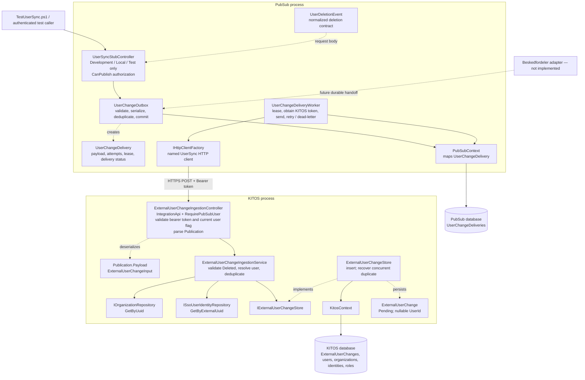
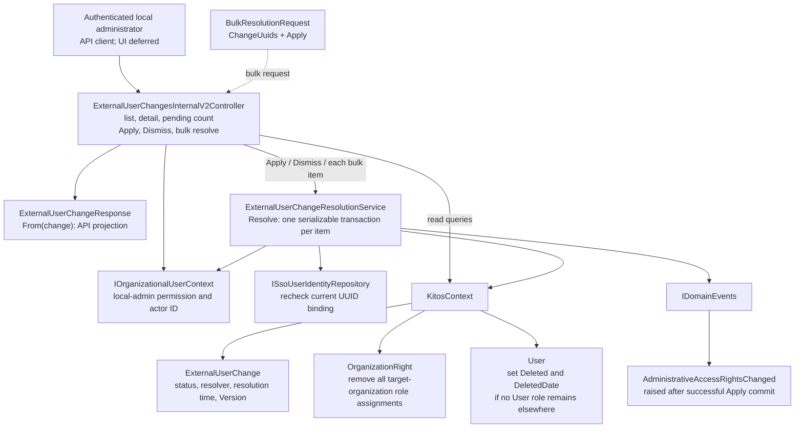
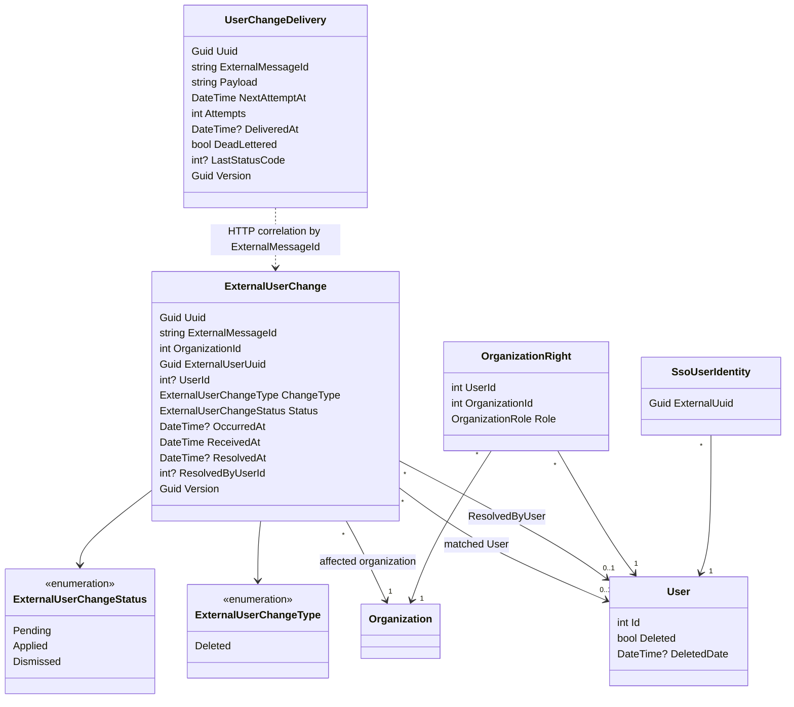
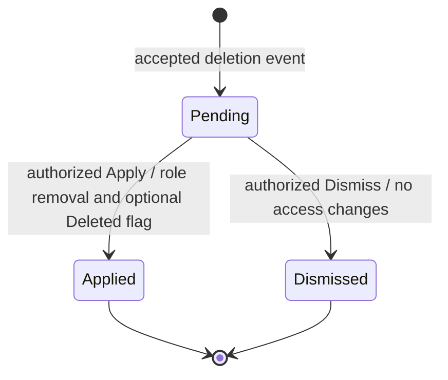

# User synchronization: classes and connections

This describes the implementation currently in this repository. Beskedfordeler subscription management and parsing are not implemented. The UI is deferred. Existing SSO behavior is unchanged: applied deletion history does not prevent subsequent SSO use.

## 1. Delivery and ingestion

Solid arrows show calls or data access. Dotted arrows show contracts, implementation relationships, or planned integration.

`UserDeletionEvent` and `ExternalUserChangeInput` represent the same JSON payload on opposite sides of HTTP; they are not a shared CLR type. The `Publication` record is the KITOS envelope with a `Payload` property.

The worker polls persisted deliveries independently of the request that enqueues them. It marks successful delivery, retries transient failures, and retains permanent failures as dead letters. Message IDs remain stable. Both databases enforce message-ID uniqueness; conflicting reuse of an ID fails.

Ingestion uses the existing SSO identity binding and separately checks for an organization `User` role. Missing or wrong-organization bindings produce an unmatched pending change. Ingestion never changes roles or the user's `Deleted` flag.

## 2. Administrator review and resolution

Apply requires a pending deletion, a valid current identity binding, and a `User` role in the affected organization. It rejects a changed bound user and global-administrator targets. Role removal, optional user soft deletion, and resolution metadata commit atomically. Other organizations' role assignments remain intact. Dismiss changes only the changelog record.

Bulk requests contain at most 100 IDs. Each distinct item uses its own transaction and reports success or failure independently. Serializable transactions and the `Version` concurrency token prevent two administrators from resolving the same record successfully.

## 3. Persistent model

The last dotted connection is not a database foreign key: these records live in separate databases. `ExternalUserUuid` is resolved through `SsoUserIdentity.ExternalUuid`; the changelog does not own or replace the existing identity mapping.

An identical replay returns the existing record without resetting its status. A failed Apply leaves it pending. Subsequent SSO use does not alter the recorded resolution history.

## 4. Supporting classes and registration

| Class / component | Connection and responsibility |
|---|---|
| `ExternalUserChangeMap` | EF mapping for `ExternalUserChange`: unique message ID, organization/status/time index, concurrency token, restricted foreign-key deletion. Applied by `KitosContext`. |
| `AddExternalUserChanges` | KITOS migration creating the changelog table and indexes. Its designer and `KitosContextModelSnapshot` describe the EF model. |
| `AddUserChangeDeliveries` | PubSub migration creating the durable delivery table. Mapping is inside `PubSubContext`; its snapshot records the model. |
| `KitosServiceRegistration` | Registers ingestion and resolution services and binds `IExternalUserChangeStore` to `ExternalUserChangeStore`. |
| PubSub `Program` | Registers `UserChangeOutbox`, the hosted `UserChangeDeliveryWorker`, and the `UserSync` HTTP client with a 30-second timeout and redirects disabled. |
| `ApiV2Controller` | Base class of the ingestion controller; provides API response/error infrastructure. Ingestion authenticates using HMAC rather than a user session. |
| `InternalApiV2Controller` | Base class of the administrator controller; existing authenticated internal API infrastructure. Organization-local authorization is checked explicitly. |
| `IConfiguration` | Supplies `UserSync` settings, including the callback key, destination, worker enablement, and stub enablement. |
| `IWebHostEnvironment` | Helps the stub controller restrict the command to development/test environments. |
| `IServiceScopeFactory` | Gives the background worker a scoped `PubSubContext` for each delivery batch. |
| `ILogger<UserChangeDeliveryWorker>` | Records delivery failures and retry/dead-letter outcomes. |
| `Result<T, OperationError>` / `OperationFailure` | Carry service success or validation, authorization, conflict, and not-found failures to API responses. |

## 5. Verification connections

| Test class | Main components covered |
|---|---|
| `ExternalUserChangeIngestionServiceTest` | Ingestion validation, identity/membership matching, replay/conflict handling, timestamp precision, and unchanged access. |
| `ExternalUserChangeIngestionControllerTest` | HMAC callback authentication, malformed envelopes, missing configuration, and accepted publication. |
| `UserChangeDeliveryTest` | PubSub outbox and delivery worker: stable replay, delivery retries, signatures, and failure classification. |
| `UserSyncPersistenceTest` | Real PostgreSQL persistence, migration round trip, concurrent duplicate inserts/resolutions, organization role removal, last-organization deletion, and unmatched identities. |

For endpoint paths, configuration, and repeatable commands, see [USER_SYNC.md](USER_SYNC.md).
