# Context based authorization model

[Original Confluence page](https://strongminds.atlassian.net/wiki/spaces/KITOS/pages/862584879)

## Security model reference

See <https://strongminds.atlassian.net/wiki/spaces/KITOS/pages/860946433>

## Background

### Motivation

As part of the initial efforts of releasing a draft V1 API, the epic <https://os2web.atlassian.net/browse/KITOSUDV-91> defined a set of stories and preparations which aimed to

* Get an overview of the security model as it “should be” (the rules that should apply)
* Destill the different existing approaches into a set of core rules and conceptual components (see <https://strongminds.atlassian.net/wiki/spaces/KITOS/pages/860946433>)
* Define a software model to consolidate the existing knowledge into a concise model, which could provide the answer to whether or not a specific action was available in a given context or not.
* Make it generic enough to support the large amount of existing use cases supported by a vast amount of API (mostly CRUD based) controllers (we needed security without changing the entire world first)

### Factors at play

This analysis resulted in a model in which the different factors of the security model have been accounted for. The factors that influence the result of an authorization are:

* Organizational memberships
* Global roles
* Local roles - administrative as well as business related
* Action context - some actions have very specific requirements not covered by a generic “can update” answer on a single entity
* Object sharing and the prerequisites for that

### Requirements

Based on that we knew that we needed a model that was capable of answering the follwing questions:

* To support broad queries, what’s the read access level of a user?

    * For all data in a specific organization
    * For all data across organizations
    * For a specific object

* To support individual object access rights, Is a specific user allowed to

    * Create an object
    * Update an object
    * Read an object
    * Delete an object

* To support answers to very specific actions, does a user have _this_ permission

    * Custom permissions must be supported but always considered a subset of the generic CRUD permissions.

## Overview

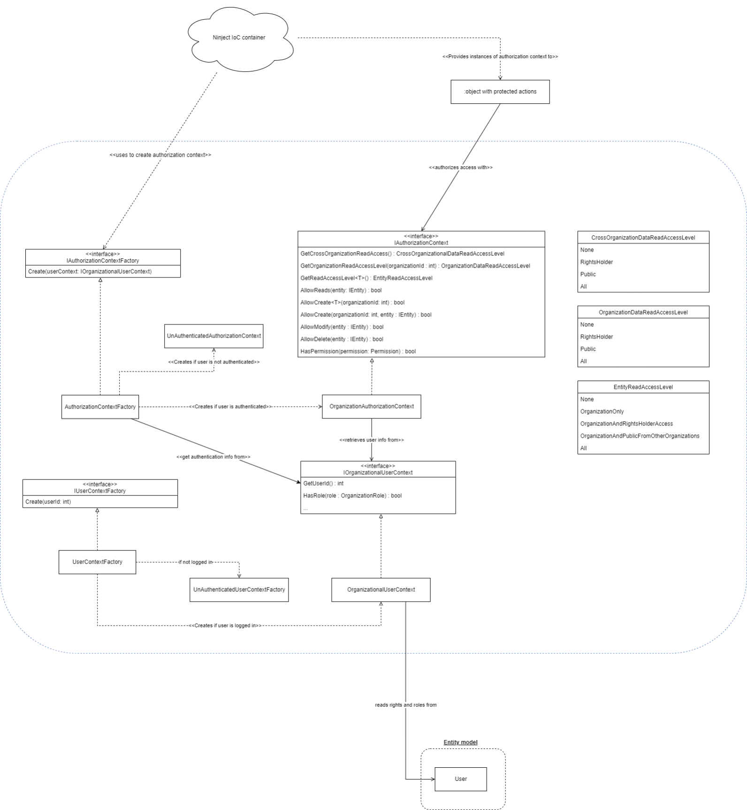

The authorization model consists of two major components:

* The **User context** which contains information of the currently authenticated user including

    * Id
    * Organizational memberships and roles
    * Global roles

* The **Authorization context** which realizes the answers to the genric questions identified during [requiements identification](context-based-authorization-model.md). The answers to the questions are based on the information provided by the User Context combined with the rules stated in the security model described in the <https://strongminds.atlassian.net/wiki/spaces/KITOS/pages/860946433> artchitecture.

Both the **IOrganizationalUserContext** and the **IAuthorizationContext** are available for **dependency injection**, so interaction with the factories is only done by the Ninject object factory functions.

Using **injection** of **either context** or a **both**, an application service should be able to get answers to genric authorization questions as well as formulating it’s own, action-specific permissions based on information extracted from the user context.

This encourages **reuse** of **generic rules** wile still **enabling fine-grained permission** schemes where a CRUD based approach is not suitable.

## Developer’s guide

The following section provides decision charts and examples of different situations requiring authorized access to an action.

### Best practices

* If working with single entities, prefer simple CRUD authorization
* When working with CRUD authorization, always apply authorization checks to the root entity. This is the one “thing” we are working with as a whole. At the same time it keeps the generic model compact since very specific scenarios should be kept out of the generic model.
* When a specific action (on an entity) has more fine-grained permission requirements than the entity as a whole, implement that a custom permission or add the requirements in the application service exposing the use case. BEFORE checking the specific rule, DO apply the generic CRUD authorization (if you cannot modify it in general then you there is no need to check a specific modification rule)
* If an action is not related to an entity/set, use the user context and implement the custom auth checks in the application service exposing the use case

    * **NOTE:** If the auth check can be extracted to an actual permission which is to be reused elsewhere, prefer implementing it as a permission.

* When working with queries DO use the access level methods on the generic authorization context (whether working with or without a specific organizational context).

### Working on a single entity (CRUD)

#### Read

##### Root

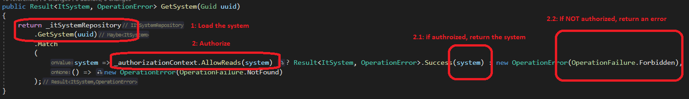

##### Child

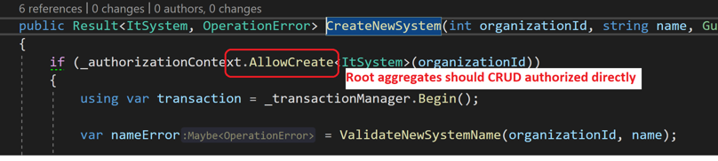

#### Create

##### Root

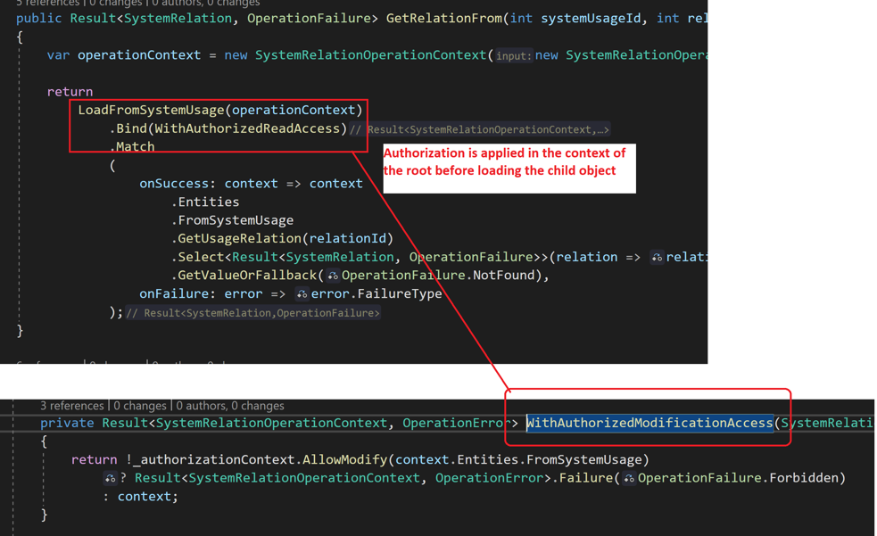

##### Child

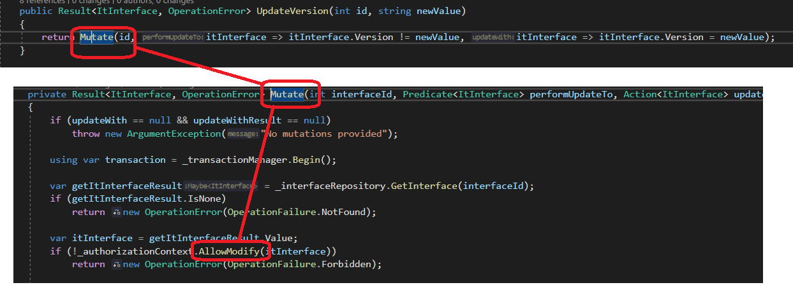

#### Modify

##### Root

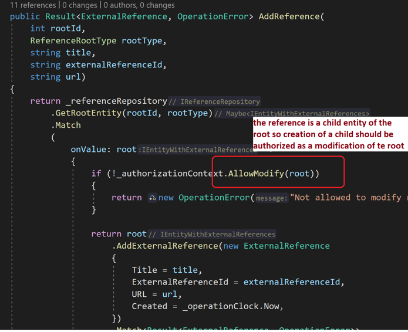

##### Child

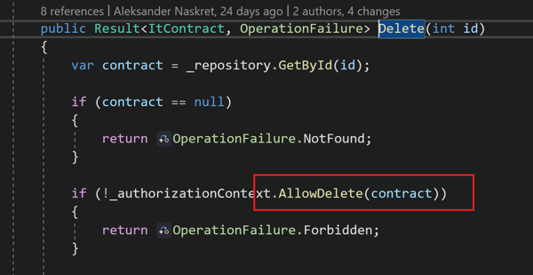

#### Delete

##### Root

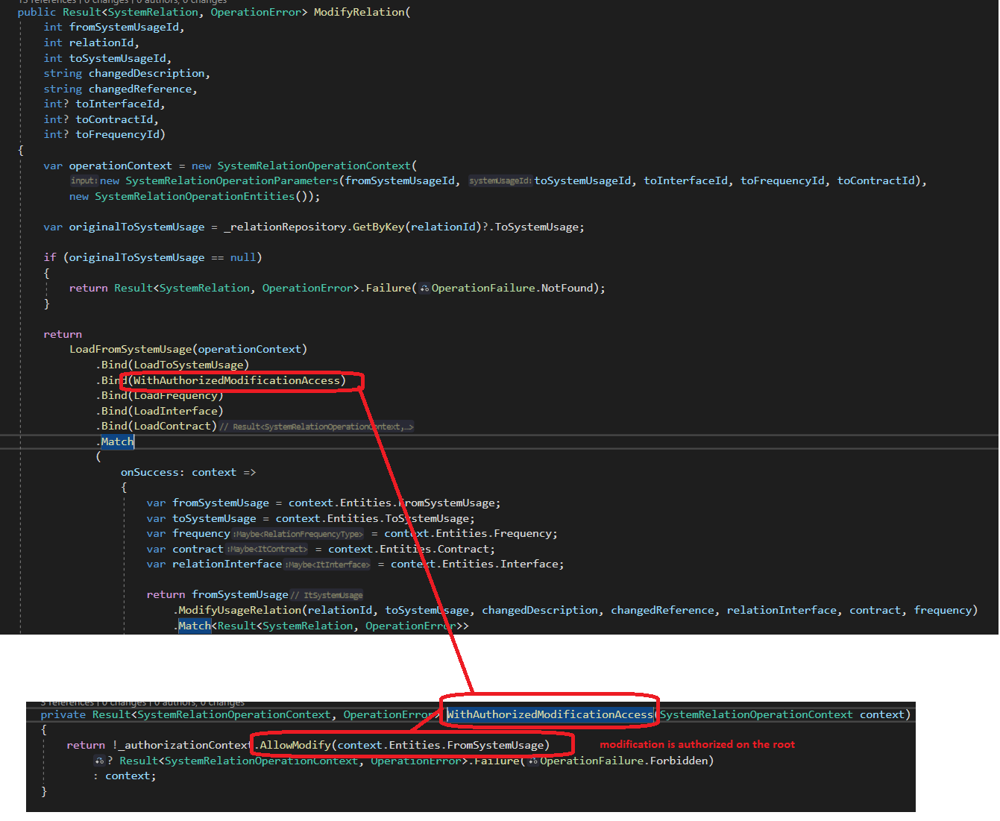

##### Child

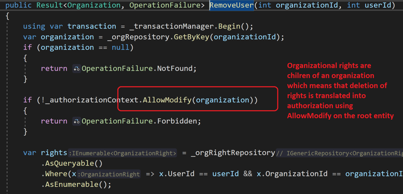

### Working with queries

Working with queries is different than working with individual objects. Since we don’t want to load all objects into memory to perform access control check there, we must use information on the _user context_ to derive a subset of the collection we want to query before we issue a specific query against it. This section demonstrates the solution to different situations.

Query authorization and collection reduction is influenced by

* Type of object - global or local
* User’s cross organization access level
* User’s organizational access level

#### Broad query on local objects

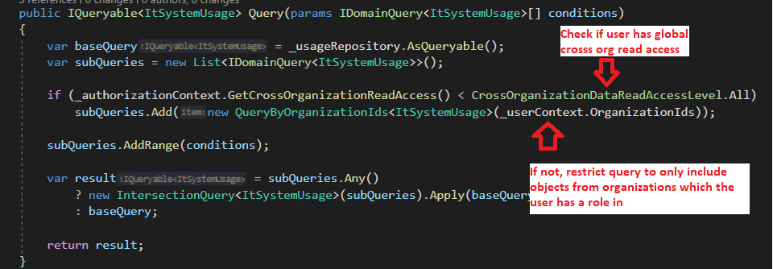

#### Specific query in a local context

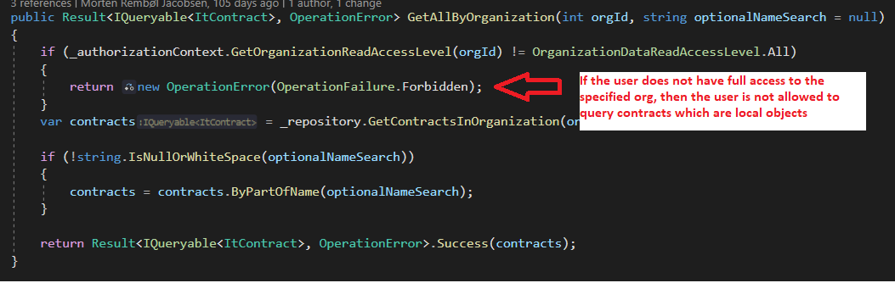

#### Specific org query on optionally local objects

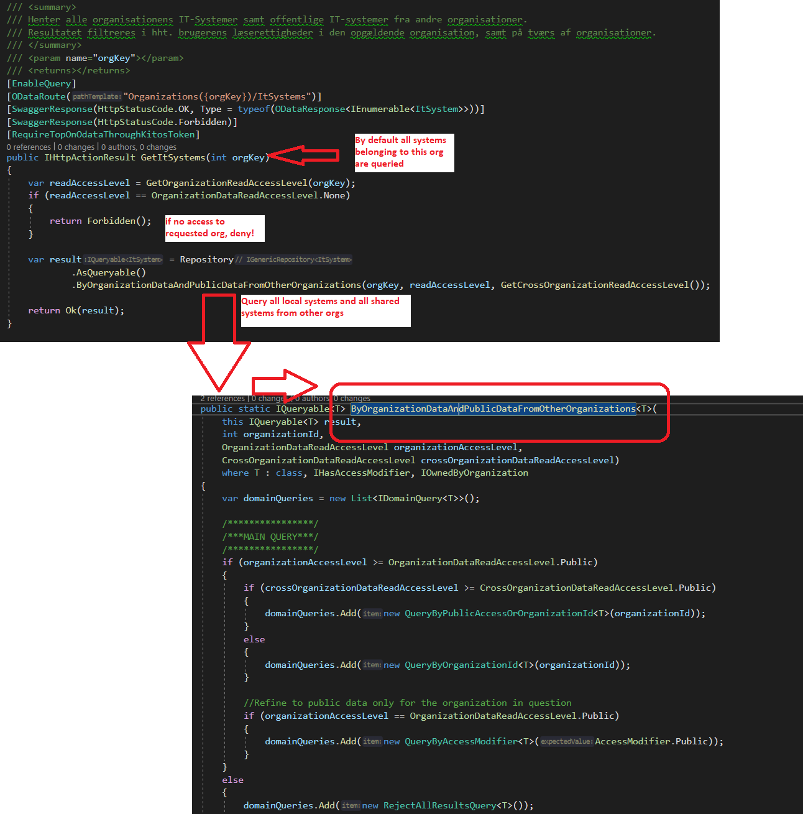

### Specialized action authorization

Sometimes an action is not related to a specific entity (CRUD) or is a collection query, so to support that scenario, we can either use information from the user context to implement authorization in the application service, or we can create a reusable “permission” which can be re-used.

#### Using permissions

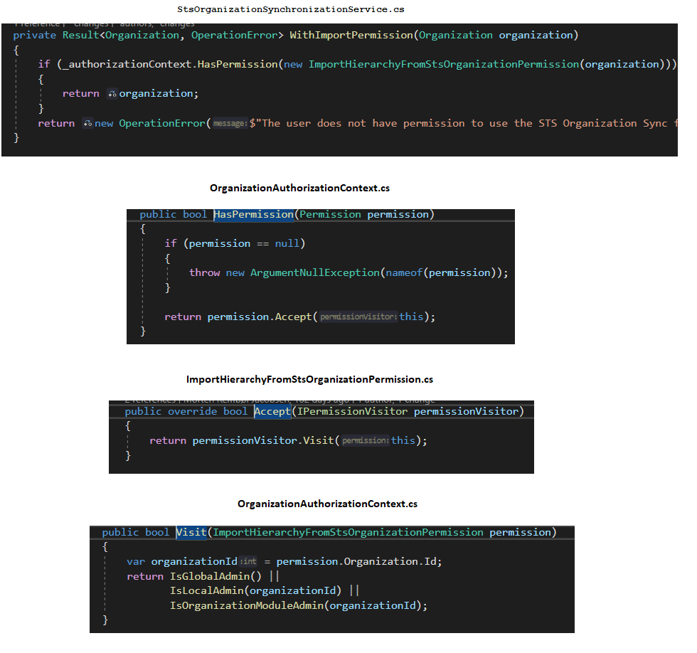

#### Implementing the permission locally

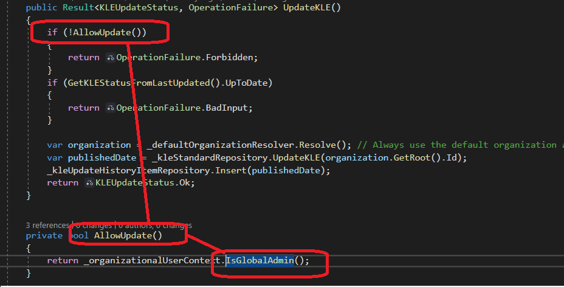

### Decision chart for authorizing an command

**TODO**

### Decision chart for authorizing an query

**TODO**
