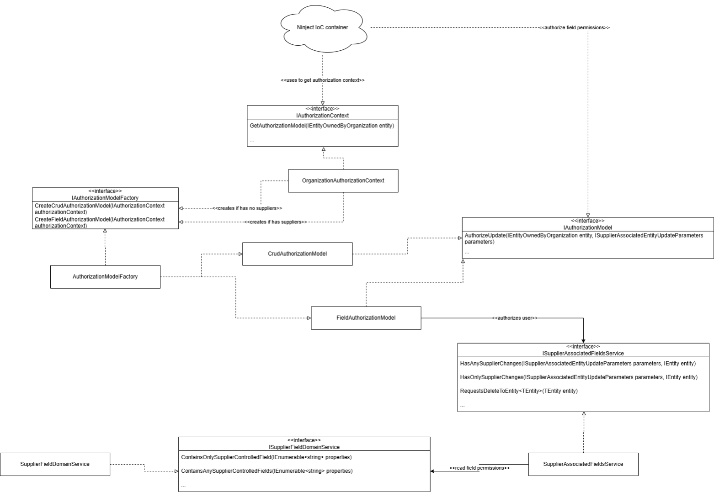
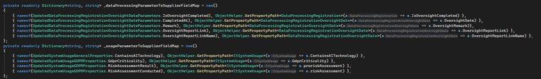
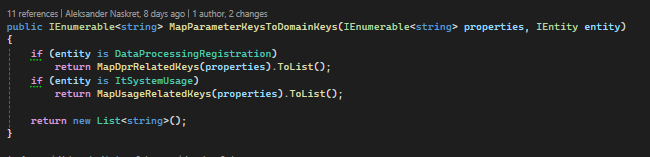
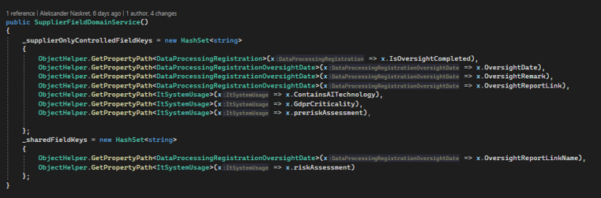

# Field based authorization

[Original Confluence page](https://strongminds.atlassian.net/wiki/spaces/KITOS/pages/1297448961)

# Security model reference

<https://strongminds.atlassian.net/wiki/spaces/KITOS/pages/860946433>

# Background

## Motivation

As part of the initial efforts of allowing external organizations, called suppliers, special access to the Kitos API, the epic <https://os2web.atlassian.net/browse/KITOSUDV-5449> defined the following requirements:

* Define a Supplier model that allows for pre-defined fields to be controlled by certain Organizations
* Municipalities should be allowed to choose their suppliers

## Requirements

* Supplier organization concept

    * An organization of type “Company” can be designated as a “Supplier” by Global Administrators
    * An organization can assign one or multiple Suppliers to its organization

* Upon selecting a Supplier, pre-defined fields should be disabled in the UI

    * The fields shouldn’t be disabled for Global Administrators
    * If disabled, the fields should have a “Help text” displayed on hover with information on why they are disabled

*  Organizations with an assigned supplier:

    * Only Supplier API Users from the assigned supplier can edit supplier-only fields
    * Both Supplier API Users from the assigned supplier and regular users should be able to edit shared fields
    * Supplier API Users shouldn’t be allowed to edit non-supplier fields IF they don’t have proper [module access rights](https://strongminds.atlassian.net/wiki/spaces/KITOS/pages/860946433/Security#Authorization)

* If an Organization doesn’t have a supplier assigned, the pre-defined supplier fields should rely on the existing [module access rights](https://strongminds.atlassian.net/wiki/spaces/KITOS/pages/860946433/Security#Authorization)

# Overview

The authorization model decides if a field should be authorized using the field-based authorization or context-based authorization ([Module access rights](https://strongminds.atlassian.net/wiki/spaces/KITOS/pages/860946433/Security#Authorization)).

To get the correct authorization model, the following checks are made:

* Does the organization have any suppliers assigned?
* Are any fields that are to be modified by the request supplier fields?

If both are true, the field-based authorization is used.

At the moment of writing (28.10.2025), the field-based authorization model is only implemented for the following entities: ItSystemUsage and DataProcessingRegistration.
It only covers these pre-defined fields:

* ItSystemUsage

    * ContainsAITechnology
    * GdprCriticality
    * PreriskAssessment

* DataProcessingRegistration

    * IsOversightCompleted
    * OversightDate (DataProcessingRegistration entity)

        * OversightDate
        * OversightReportLink
        * OversightRemark

Shared fields:

* ItSystemUsage

    * RiskAssessment

* DataProcessingRegistration

    * OversightReportLinkName

# Developer’s guide

It is recommended to, in the future, move away from the hard-coded fields in favor of a better, more flexible solution

The fields are being evaluated based on their field key. The key consists of a Class name and the property path, for example: ItSystemUsage.Name

The properties with changes from an UpdateParameters model for a given entity are being mapped to the previously mentioned key

## Adding a new field

### Extending the keys

First, make sure to extend the hard-coded field keys

### Extending the mapping

The new field needs to be added to the \_fieldMaps

If it’s a new entity, the **MapParameterKeysToDomainKeys** method needs to be extended by the entity's type, and a corresponding **Map** method

