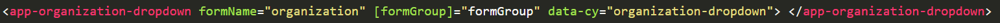
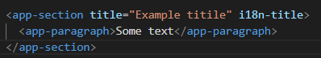
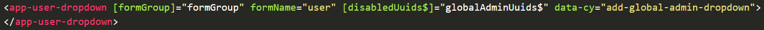

# Reusable components

[Original Confluence page](https://strongminds.atlassian.net/wiki/spaces/KITOS/pages/1075871745)

# Dropdowns

## Users dropdown

### Purpose

The user dropdown is a quick and easy way to make a dropdown for global users. The dropdown supports searching for both name and email. Additionally it supports an optional argument for disabled uuids, which can be used to exclude certain users from the available options.

### How to use

As of writing the dropdown only supports one hook, which is a FormGroup and a form name. An example usage can be seen below:

## Organization dropdown

### Purpose

The organization dropdown is for quickly making a dropdown for organizations. The dropdown supports searching for both organization name and cvr.

### How to use

As of writing the dropdown only supports one hook, which is a FormGroup and a form name. An example usage can be seen below:

# UI Alignment

## Section

### Purpose

The Section component is meant for creating smaller sections inside of a card with a certain title

### How to use

The section only requires assigning it a title + wrapping other elements inside it.
Color is optional

