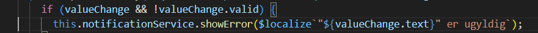
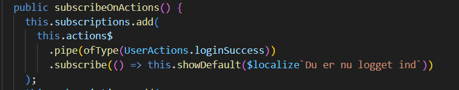

# UI Notifications

[Original Confluence page](https://strongminds.atlassian.net/wiki/spaces/KITOS/pages/1046970375)

As shown above, `notification.service.ts` subscribes to actions and reacts by showing a notification. To use it as a subscriber of actions:

1: inject the service into the component needing a notification.

2: from the component, dispatch a fitting action.

3: in the notification service, if it is not already there, add a subscription to the given action and show a fitting notification.

The above pattern should be used for notifications unless you have some specific requirements that make it undesirable. Such a requirement could be including a custom message from the component in the notification, in which case the service can be injected and called directly, like this:

