# Local UI Customization

[Original Confluence page](https://strongminds.atlassian.net/wiki/spaces/KITOS/pages/819658753)

# Introduction

This page describes the design of the “Local UI Customization” functionality in KITOS.

Originally motivated by <https://os2web.atlassian.net/browse/KITOSUDV-2483> and discussed in <https://strongminds.atlassian.net/wiki/spaces/KITOS/pages/816611335> , this functionality allows a **Local Admin** in an organization, to enable/disable parts of the UI, which cover data entries not used by the organization.

* The customization only applies to the UI, and has no logical consequences to the functionality of the backend application.
* The UI configuration is not exposed on the API V2, as it deals with configurations spawned- and owned by the KITOS UI.

# Problem description

KITOS provides a large number of registration options grouped into several subsets with the largest type being a top level module (IT-Contract, IT-System etc) which may cover one or more sub-modules with data registration fields in them. The following illustration briefly shows the logical grouping of settings and modules.

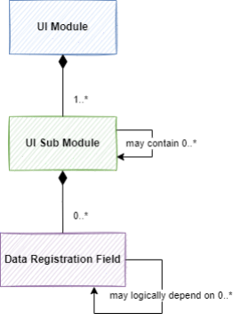

Since KITOS has been built to cater for the needs of all municipalities using KITOS, some options are only relavant to users in a subset of the organizations. To simplify the use of KITOS, the “user group” prioritized the development of functionality to enable the **Local Admin** to:

* Hide an entire module (already part of KITOS)
* Hide “tabs” on the details pages of root aggregates such as IT-Systems or IT-Contracts
* Hide individual fields inside the tabs

Hiding tabs (groups of settings) or fields, should also result in the hidden fields being removed from the list of available columns in the overview, so that the user experiences a consistent UI and is only able to view data relevant to the organization.

## Related fields

In KITOS, some fields are related to one another and it may not make sense to provide the ability to hide them one by one. In that case, we must (in the customization configuration) reduce the multiple fields into one and just create a single UI customization field for them. In that case we should allow an additional help text to be added to assist the Local Admin who is doing the setup.

## Mandatory sub modules and fields

In KITOS some fields or sub modules are mandatory (e.g. the front page of an IT-System), so in that context, it should not be possible to “hide them”. If they appear in the customization UI, they should be `read only`and there should be an explanatory help text.

# Solution overview

The following diagram gives a _high level_ overview of the components which make up the solution for enabling Local Admins to customize the KITOS UI.

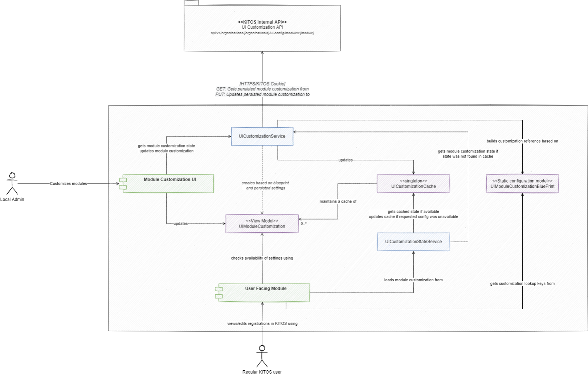

As illustrated, the use of the customization model has two use cases.

* **The “editor” use case**: In this scenario, the Local Admin customizes the modules and fields within, to hide settings which are not used by the organization. The preferences are saved to the KITOS database through the internal API for UI customization, only accessible to Local Admins of the organization being configured.

    * The technical components involved in this use case are:

        * The **Module Customization UI** which enables the local admin to customize the UI of one or more UI modules in KITOS.
        * The **UICustomizationService** which creates a **UICustomization** (view model) based on a **UICustomizationBluePrint** and with input from the preferences loaded from the KITOS backend.
        * The **UICustomizationStateService** which exposes the latest state of the UICustomization to any user facing module in the KITOS UI. It does so by maintaining a cache (**UICustomizationCache**)


* **The “regular user” use case:** In this scenario, the regular day-to-day KITOS user views and edits data available throught the customized KITOS UI.

    * The technical components involved in this use case are:

        * The **User Facing Module** which covers any user facing module for which customization applies - that could be the IT-System overview or IT-System details page.
        * The **UICustomizationStateService** which provides a cached version of the UI Customization for the module in question.
        * The **UICustomizationBluePrint** which is used to get a **strongly typed spec** (as opposed to json or other text formats) for doing queries in the **UICustomization** (view model)


## Customization Blue Prints

Customization blue prints are **static definitions** which serve as the configuration reference for UI customization. They are born and maintained inside the frontend application, and are implemented in TypeScript files to allow User Facing Modules to pick strongly typed lookup keys when querying availability state of settings/modules in KITOS.

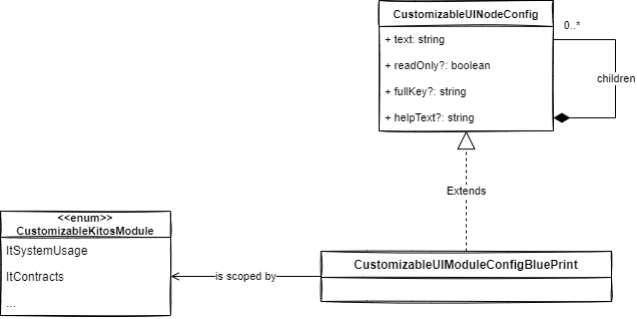

### Mandatory post processing of the Blue Print to add configuration keys (fullKey)

When the User Facing Module uses the blueprint to query the state of the view model, the view model will use the `fullKey`property of the CustomizableUINodeConfig provided.

This key is not specified up front by the programmer, but added by a call to the `processConfigurationTree` function which walks the configuration structure and applies a “full key” based on the keys of the ancestors and it’s own key:

Example:

```
module Kitos.Models.UICustomization.Configs.BluePrints {
    export const ItSystemUsages= {
        module: UICustomization.CustomizableKitosModule.ItSystemUsage,
        readOnly: false,
        helpText: "Bemærk: Skjules faneblad/felt fjernes relaterede felt(er) også fra overbliksbillederne.",
        text: "IT-Systemer i anvendelse",
        children: {
            frontPage: {
                text: "Systemforside",
                readOnly: true,
                helpText: Configs.helpTexts.cannotChangeTab
            }
       ..
       .
        }
    };

    processConfigurationTree(ItSystemUsages.module, ItSystemUsages, []);
}
```

Once `processConfigurationTree` has been called on the `ItSystemUsageUiCustomizationBluePrint `, the values of the fullKeys will be:

```
"ItSystemUsages"
 |
 |________ "ItSystemUsages.frontPage"
```

Where `"ItSystemUsages"` will be the result of `ItSystemUsages.fullKey` and` "ItSystemUsages.frontPage"` will be the result of `ItSystemUsages.children.frontPage.fullKey`

## Customization View Model

The Customization View model is used by the:

* **Module Customization UI** to update the availability of settings/modules in KITOS
* **User Facing Module** to determine whether or not a module/setting should be visible in the UI.

* Each customization module always has a “**root**” - the module” which in has any level of descendants underneath (the model itself does add restrictions to this).
* The **settings** are **applied** **hierarchically** meaning that disabling a “parent” will automatically disable all descendants and vice versa and it will not be allowed to enable a child if the parent is disabled.
* “**Read Only**” means that the availability of the node is locked and is enforced on the node level meaning that you may be allowed to edit the availability of a child setting even if the parent is read only (as long the parent is available)
* “**SubtreeIsComplete**” property set to `true` will cause the node to disable itself, when all of it’s children are disabled. The property is optional.

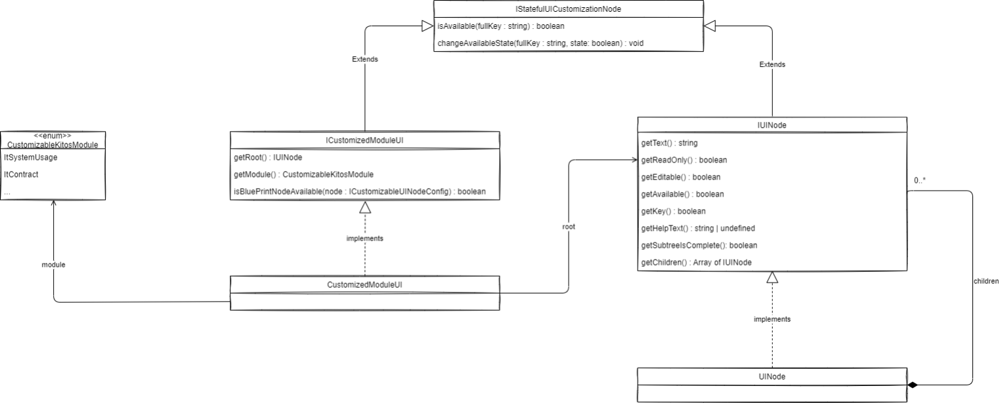

## The Customization Module UI (the user perspective)

The customization UI is implemented generically in an AngularJS directive and can be used as demonstrated in the following example:

`<data-local-ui-customization data-customized-module-id="ItSystemUsages" />`

The data attribute `data-customized-module-id` must point to a valid member in the `CustomizableKitosModule`enum and a valid “blueprint resolution” must exist in the `loadBluePrint()` method of the `UICustomizationService` class.

Example output of the directive:

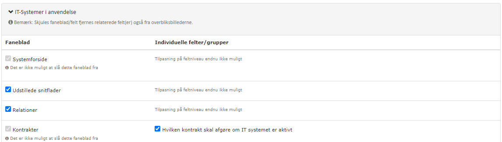

The directive is typically used on the “Local Admin” pages, which contains customization of “choice types” for each of the top-level KITOS modules e.g. at `/#/local-config/system`.

## The Backend

In the context of UI customization, the role of the backend is less intrusive than usual. The main purpose of the backend API and model is to:

* Allow per-organization module customization
* Require that anyone editing module customization of an organization has the role of Local Admin.
* Require that anyone reading the module customization of an organization must have full read-access to the data of the organization (Global Admin or a user with a role in the organization)
* Enforce internal-api-access constraints to the API endpoints, so that they don’t show up in the documentation and fail if accessed with a KITOS token.

### Data model in the backend:

As opposed to the UI model, the backend model is only two levels deep:

* **Level 1: UIModuleCustomization** is the scope of the customized nodes. Each organization may have zero or more module customizations but only one per. `module` (the attribute value in `UIModuleCustomization`)
* **Level 2: CustomizedUINode** represents a key (e.g. `module1.tab1.setting1`) along with the “enabled” state, which must be used when being [applied to the model in the UI](local-ui-customization.md). In the backend, all nodes are stored in the same list, but based on their “key” their state will be applied correctly once loaded into the UI where the value of `key` will match the `fullKey` of the `ICustomizableUINodeConfig` from the blue print.

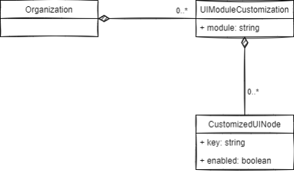

## How persisted settings are applied to blue prints

When configurations are loaded into memory, we must make sure that we have the flexibility to support the following situations:

* If a new node has been added to the blue print exists since the last time the configuration was saved in the backend, the new node will get the state from the blue print along with any hierarchically dictated state (if the parent is unavailable based on the server state, it will becaome unavailable)
* If a node has been removed from the blue print, the setting from the server will be ignored.

In order to do so, we load the blue print, and then, while we build the view model, we check if a node has been disabled in the persisted configuration.

Doing it this way, the blue print can evolve over time since the main structure of the configuration is always based on that and only the “available” state is influenced by the persisted values from the backend.


# How-to UI v2

The following sections explain, in detail, how to perform some common tasks when working with the ui module customization in the v2 UI. If followed sequentially, they describe how to add UI customization for a new module.

If your blueprint relates to a module that did not have customization in v1, add its module key to the `UIModuleConfigKey `enum:

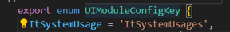

### Adding a new blueprint


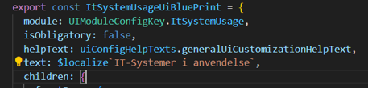

The blueprints describe the default state of each module, and are based on the ones used in the v1 UI which can be copied. Only a few fields have been renamed:

| **V1 name** | **V2 name** |
| --- | --- |
| readOnly | isObligatory |
| subtreeIsComplete  | disableIfSubtreeDisabled |

1. Copy your blueprint from the v1 code, apply renamings as above, and save it in `models/ui-config/blueprints`.
2. in `ui-config.service.ts`, add your new blueprint as a return option to the switch statement in `resolveUIModuleBlueprint(module)`:

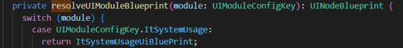

#### Adding a new blueprint node

Any new blueprint nodes are added at the appropriate level:

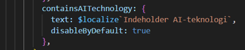

In agreement with OS2 on 13/3/25, remember to set `disableByDefault: true` for fields related to new features so local admins can choose when to enable the features in their organization.

### Adding a local admin config page

To add the page where local admins can change the UI config for their municipality, you need to retrieve customizations from the backend and have them applied to the new blueprint before being served to the components as finished config.

1. In `local-admin.component`, extend it’s ngOnInit with an action dispatch using your new module's key:

    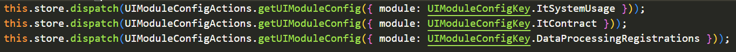

2.   Add the same dispatch at the modular level. For example we add a dispatch call for It system usage, in `it-system-usages.component`’s ngOnInit method.
3. Adapt the `setup `cypress command for e2e tests, so existing tests don’t fail.

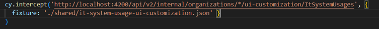

4. In the html for you new local admin page, add `app-ui-config` and provide it with the corresponding UIModuleConfigKey:

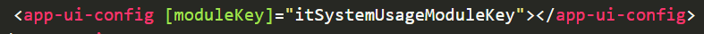

### Adding selectors for module tabs and fields/groups

_NOTE: this is a prerequisite for the next two steps where config is applied to the UI._

1. In `store/ui-module-customization/selectors.ts`, use the `createTabEnabledSelector(tabFullKey)` and `createFieldOrGroupEnabledSelector(tabFullKey, fieldKey)` methods to set up new selectors for each tab or field/group you want to be able to toggle, naming them like this:

    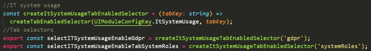


    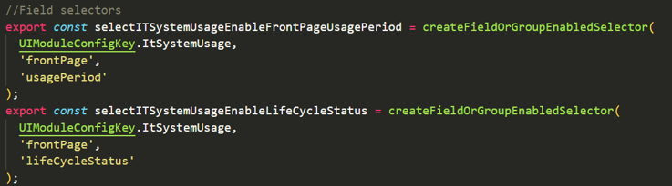


### Applying UI config to the module overview

1. To find out which columns are affected by which config settings, consult the v1 ui in `<module>-overview.controller.ts` and look for this kind of inclusionCriterion:

    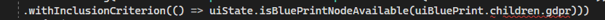

2. In `grid-ui-config.service.ts`, add a private `get<module>GridConfig()`method to combine all relevant tab/field enabling selectors and set up the connections between tabs/fields and grid columns you documented in step 1:

    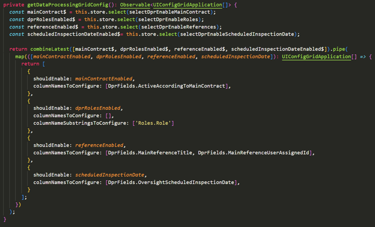


3. In `grid-ui-config.service.ts` extend the switch case with your new module key and use the method you created in step 2:

    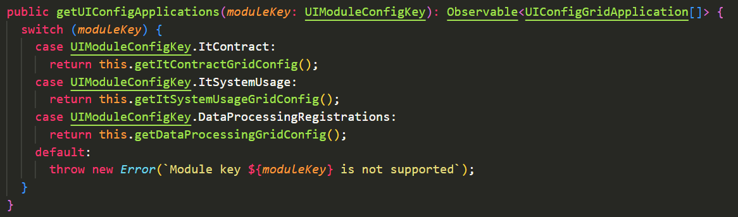

4. Update your grid columns by injecting the `ui-config.service.ts` and pipe the grid columns through the `filterGridColumnsByUIConfig(<moduleKey>)` method.

    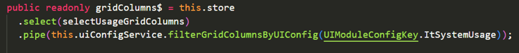


### Applying UI config to the module details page

1. In the component containing the element that you want to toggle, select its enabled state from the store:

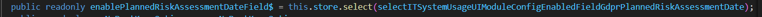

2. Apply the result of this selector where required using `*ngIf` if targeting a regular element:

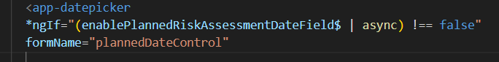

3. Or using the “enabled” field if targeting a `navigation-drawer` item:

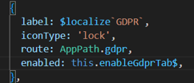

# How-to UI v1

The following sections explain, in detail, how to perform some common tasks when working with the ui module customization  in the v1 UI.

## Applying customization states to the UI

In the context of an existing configuration, in order to apply it in the UI, the following example demonstrates how:

### In the view

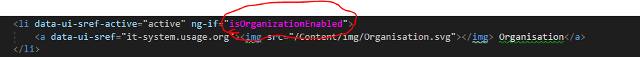

### In the controller

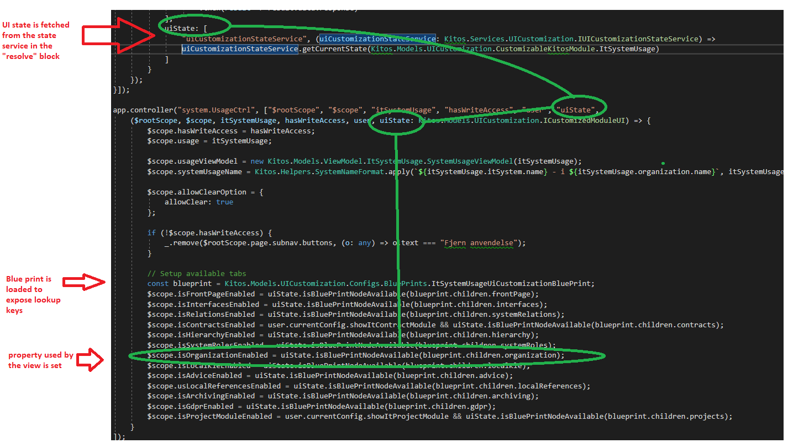

### On the overview page

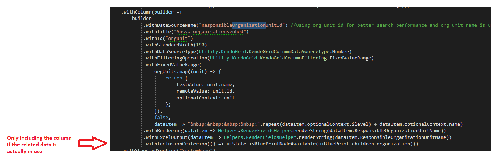

### Combining it with the root module availability

In the current solution, there is no logical dependency between the new “UI Customization” and the old “toggle module on/off”.

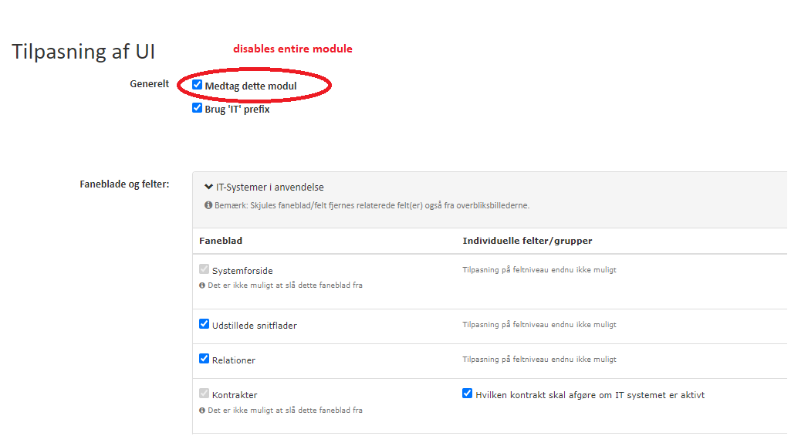

In the case of the example above, the “Kontrakter” setting is disabled but set as available but once rendered, it should not be available if the “Contracts” module has been disabled.

In order to respect both configurations, we need to add the following:

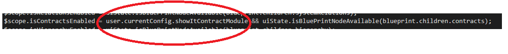

## Adding a new customizable component

In order to add a completely new component do the following:

### Extend the enum

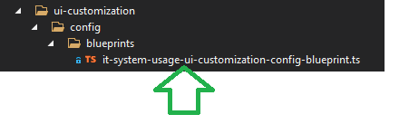

### Create the blue print

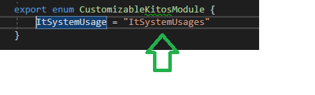

```
module Kitos.Models.UICustomization.Configs.BluePrints {
    export const ItSystemUsageUiCustomizationBluePrint = {
        module: UICustomization.CustomizableKitosModule.ItSystemUsage,
        readOnly: false,
        helpText: "Bemærk: Skjules faneblad/felt fjernes relaterede felt(er) også fra overbliksbillederne.",
        text: "IT-Systemer i anvendelse",
        subtreeIsComplete: true,      //subtreeIsComplete is an optional proper
        children: {
            frontPage: {
                text: "Systemforside",
                readOnly: true,
                helpText: Configs.helpTexts.cannotChangeTab
            },
            interfaces: {
                text: "Udstillede snitflader"
            },
         ....
         ..
         .
        }
    };

    // Mandatory post-processing to build the keys
    processConfigurationTree(ItSystemUsageUiCustomizationBluePrint.module, ItSystemUsageUiCustomizationBluePrint, []);
}
```

:exclamation: _Remember to call_ `processConfigurationTree` _in order to add values to the “fullKey” property of the members of the configuration tree._

:exclamation: _Remember that subtreeIsComplete property is optional, and will cause the root node to disable along with it’s children_

### Extend the blue print mapping

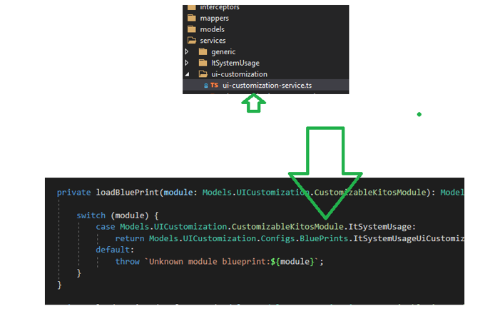

### Add configuration UI

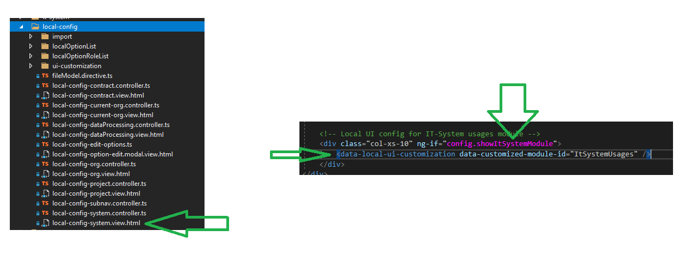

### Apply the configuration

<local-ui-customization.md>

## Changing an existing customizable component

### Adding a new setting/tab

* Open the blue print
* Extend with the new setting where suitable in the hierarchy

Example (see `myNewTab` and `myNewSetting`):

```
export const ItSystemUsageUiCustomizationBluePrint = {
        module: UICustomization.CustomizableKitosModule.ItSystemUsage,
        text: "IT-Systemer i anvendelse",
        children: {
            frontPage: {
                text: "Systemforside",
                readOnly: true,
                helpText: Configs.helpTexts.cannotChangeTab
            },
            myNewTab: {
                text: "NewTab"
            },
            contracts: {
                text: "Kontrakter",
                readOnly: true,
                helpText: Configs.helpTexts.cannotChangeTabOnlyThroughModuleConfig,
                children: {
                    selectContractToDetermineIfItSystemIsActive: {
                        text: "Hvilken kontrakt skal afgøre om IT systemet er aktivt"
                    },
                    myNewSetting: {
                       text: "my new setting"
                    }
                }
            },
```

### Disabling node when all children are disabled

If a node should disable when all of its children are disabled add `subtreeIsComplete: true` property (line 9) to the node that should disable

```
export const ItSystemUsageUiCustomizationBluePrint = {
        module: UICustomization.CustomizableKitosModule.ItSystemUsage,
        text: "IT-Systemer i anvendelse",
        children: {
            contracts: {
                text: "Kontrakter",
                readOnly: true,
                helpText: Configs.helpTexts.cannotChangeTabOnlyThroughModuleConfig,
                subtreeIsComplete: true,  //<---------
                children: {
                    selectContractToDetermineIfItSystemIsActive: {
                        text: "Hvilken kontrakt skal afgøre om IT systemet er aktivt"
                    },
                    myNewSetting: {
                       text: "my new setting"
                    }
                }
            },
```


## Removing a setting

* Open the blue print
* Remove the setting
* Remove any use of the setting (compiler should fail if the blue print has been used as lookup key)

### Moving a setting from one tab to another

* Open the blue print
* Move the setting

:exclamation: _Moving a setting from one tab to another will change the “fullKey” so any persisted settings will no longer apply and the local admins must re-configure the setting if it were individually disabled before. **In order to prevent that** do a db migration where the old keys (if any) are transformed to apply to the new structure._
