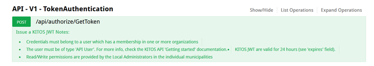
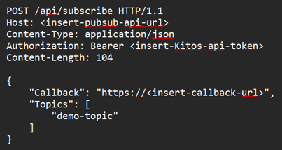

# Flow 1

[Original Confluence page](https://strongminds.atlassian.net/wiki/spaces/KITOS/pages/1097138177)

# Introduction

This document describes Flow 1 and Flow 1.1 for integrating DBS with Kitos.

DBS should be able to update the legal names and legal data processors of IT systems in Kitos.

Kitos should publish events to a new PubSub API when the names and data processors of IT systems in Kitos change. DBS can subscribe to these changes.

As of writing, on staging the pubsub API lives on https://staging-pubsub.kitos.dk/

## Overview - DBS system or data processor name

When the system or data processor name of a DBS System changes, the corresponding System should get an update in Kitos.

Data required:

* System Uuid

Optional:

* System name
* Dataprocessor name

### API

#### Request

| **PATCH** | /api/v2/it-systems/{uuid}/dbs |
| --- | --- |
| Request | {
      “systemName”: “Name of the system”,       “dataProcessorName”: “Name of the data processor”
} |

#### Response

| 204 - NoContent | The update was successful |
| --- | --- |
| 400 - BadRequest | There is a mistake in the name/names |
| 401 - Unauthorized | Error in auth header or expired token |
| 403 - Forbidden | Insufficient access rights |
| 404 - NotFound | Invalid system UUID |
| Comments | Max name length is 100 characters |
| Response | **Status code:** 204 NoContent |

## Overview - Kitos system or data processor name

When a Kitos system’s name or data processor is changed, the change should be made available for reactions in DBS. This is done using the new pub/sub component.
DBS can subscribe to these changes with the PubSubApi endpoint below. The provided callback will be the endpoint that DBS wishes to receive events on.

### Authentication

To use the Kitos PubSub API, you need a valid token from a Kitos user with the `apiUser` role. This can be retrieved from the Kitos API:

With this token, you can authorize yourself like this:

### Making a subscription

#### Request

| **POST** | /api/subscribe |
| --- | --- |
| Request | {
  "callback": "https://example.com/callback",
  "topics": \[
    "KitosITSystemChangedEvent"
  \]  
} |

#### Response

| 204 - NoContent | The subscription was successfully established |
| --- | --- |
| 400 - BadRequest | There is a mistake in the request |
| 401 - Unauthorized | Error in auth header or expired token |
| 403 - Forbidden | Insufficient access rights |
| Comments | Callback must be a valid absolute URI (including “https://”). This operation is idempotent, meaning that if you make the same request multiple times, only one subscription will added. A subscription's uniqueness is determined by the callback and topic combination. |

### Viewing subscriptions

#### Request

| **GET** | /api/subscribe |
| --- | --- |

#### Response

| 200 - Ok | \[
    {
        "uuid": "750638cc-b709-4bf5-bc81-c1e431580d55",
        "callbackUrl": "https://example.com",
        "topic": "KitosITSystemChangedEvent"
    },
    {
        "uuid": "012b18f2-be10-4c00-b229-2df913de2c86",
        "callbackUrl": "https://example.com",
        "topic": "SomeOtherEvent"
    },
\] |
| --- | --- |
| 401 - Unauthorized | Error in auth header or expired token |
| Comments | The subscriptions returned is derived from the callers token. Any subscriptions made using tokens from the associated kitos user will be returned. |

### Deleting subscriptions

#### Request

| **DELETE** | /api/subscribe/{subscriptionUuid} |
| --- | --- |

#### Response

| 204 - NoContent | The subscription was successfully deleted |
| --- | --- |
| 400 - BadRequest | Invalid UUID |
| 401 - Unauthorized | Error in auth header or expired token |
| 403 - Forbidden | Insufficient access rights |
| 404 - NotFound | No subscriptions was found with the provided UUID. |
| Comments | Subscriptions can only be deleted by the user who created them. |

# Callbacks

The following is the json model that will be sent to the specified callback. the <topic-model> depends on the topic that was subscribed to.

| Model | {     “Payload”: <topic-model> } |
| --- | --- |
| Notes: | Payload depend on the topic that was subscribed to.  |

## Topic models

### KitosITSystemChangedEvent

| Model | {
     “SystemUuid”: “value",      “SystemName”: “name”,      “DataProcessorUuid”: “value”,      “DataProcessorName”: “a name”
} |
| --- | --- |
| Notes: | Each field (excluding “systemUuid”) is optional, and will only be provided if there has been a change to the data. DataProcessorUuid and DataProcessorName can be null. **Important:** Note the difference between missing DataProcessor fields, and null values. If the data processor fields are not in the payload, it means there were no changes to report. If the data processor fields are present with the value null, it means no valid data processor was found. |

Examples:

| Data processor change | {
  "Payload": {
    "SystemUuid": "f44c96ef-4e3d-4af2-b9ed-4e06d4681f28",
    "DataProcessorUuid": "8900028e-99dd-440e-a20c-5dc3068d4374",
    "DataProcessorName": "Test1"
  }
} |
| --- | --- |
| Data processor cleared | {
  "Payload": {
    "SystemUuid": "f44c96ef-4e3d-4af2-b9ed-4e06d4681f28",
    "DataProcessorUuid": null,
    "DataProcessorName": null
  }
} |
| Name change: | {
  "Payload": {
    "SystemUuid": "f44c96ef-4e3d-4af2-b9ed-4e06d4681f28",
    "SystemName": "demotest12345"
  }
} |
