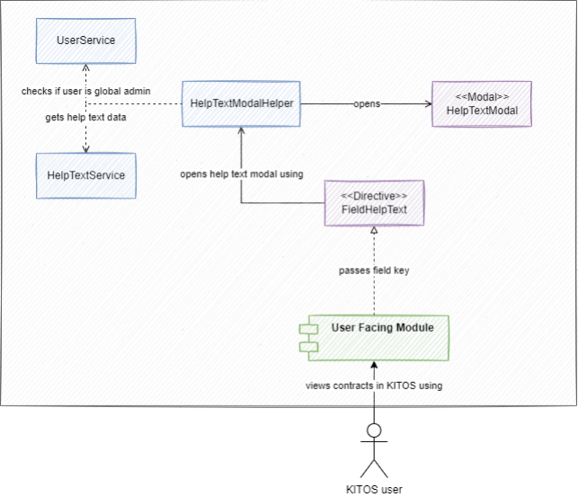
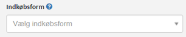
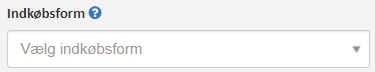
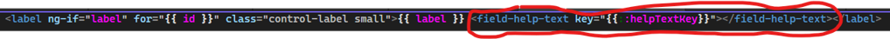
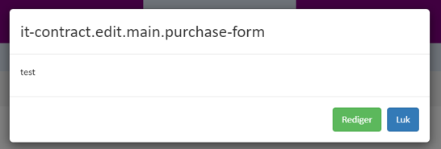

# Field Help Texts

[Original Confluence page](https://strongminds.atlassian.net/wiki/spaces/KITOS/pages/838467653)

# Introduction

This page describes the design of the “Field Help Texts” functionality in KITOS.

The feature was designed in story [KITOSUDV-2745](https://os2web.atlassian.net/browse/KITOSUDV-2745) and implemented in [KITOSUDV-3080](https://os2web.atlassian.net/browse/KITOSUDV-3080), in the following [pull request](https://github.com/Strongminds/kitos/pull/774). This functionality allows a user to view a help text in a pop-up for any configured field

# Problem description

KITOS provides a large number of helper texts, many of them display only “…”. Because of that there is a need to create a generic directive that allows for an easy implementation of already existing HelperTextModal. This directive should be displayed as an :question_mark: icon. When pressed, the HelperTextModal should open

# Solution Overview

The following diagram gives a high level overview of the components which make up the solution for using the FieldHelpText directive

As illustrated, the user views the help texts through the directive. The technical components involved in this case are:

* The **User Facing Module** which covers any user facing module containing fields for which help text was configured - that could be the IT-Contract details page or IT-System details page.
* The **FieldHelpText** directive provides the help text icon :question_mark:, and opens the HelpTextModal on click
* The **HelpTextModalHelper** which provides a help text modal instance
* The **HelpTextModal** displays help text title and text

# Applying the FieldHelpText (the programmer’s perspective)

The FieldHelpText is implemented generically in an AngularJS directive and can be used as demonstrated in the following example:

`<field-help-text key="field-key" extraCssClass="css-class"></field-help-text>`

The `key` is required. If the key is not defined the directive won’t render.

The `extraCssClass` parameter is optional. It allows for adding a custom css class/classes in order to customize the directive.

Example output of the directive:

# Applying field help text

## In the view

## The result

After implementing the directive the UI should look like on the example below:

When pressing the :question_mark: icon an instance of the HelptTextModal should open and show the help text associated with the `key`:

