# Creating a new choice type (Udfaldsrum)

[Original Confluence page](https://strongminds.atlassian.net/wiki/spaces/KITOS/pages/828375071)

# Introduction

This page describes the process of adding a new choice type, both to the backend and frontend. It doesn’t include a “how to add a new field to API V2” section, because it is already described in this [guide](../api-v2/adding-a-new-data-property-to-an-existin.md).

Contents of this page are based on the [KITOSUDV-2746](https://os2web.atlassian.net/browse/KITOSUDV-2747) task and the connected [pull request](https://github.com/Strongminds/kitos/pull/733)


:information_source:  _This guide refers to the “root” entity, by which it means the entity that is has an instance of the choice type assigned. For example: In case of_ `CriticalityType`_, the root entity would refer to the_ `ItContract`_._

# Definition of a choice type

In KITOS the admins (global and local) are able to configure a set of choice types, which may or may not be applicaple to the regular user.

A choice type consists of the following:

* A global choice type is managed by global admins and defines:

    * Name
    * Default description
    * Obligatory or not

        * if set to true the setting is always available regardless of local configuration

    * Available or not (global flag)
    * Write access

        * This flag is only available for the specialization “Role type”


* Each global choice type has a “local” version, where the Local adimins may configure:

    * Local description (replaces the global description)
    * Availability

        * If the option is globally obligatory, thís flag will be read-only
        * The option will only be available if the setting is globally available.


User defined choice types differ greatly from system defined choice types (enums), since we cannot create hard couplings to specific entities of choice types inside the code.

# Creating a new choice type

## Backend

### **In the DomainModel project**

#### **In the RootEntity directory**

Create a new class with the choice type, it should reference the root entity .

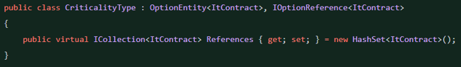


New Choice Type Entity - CriticalityType
#### **In the LocalOptions directory**

Create a `Local{Choice Type}` entity

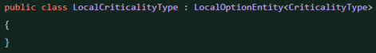


Newly created LocalCriticalityType
#### **In the RootEntity class**

Remember to reference the newly created Choice Type

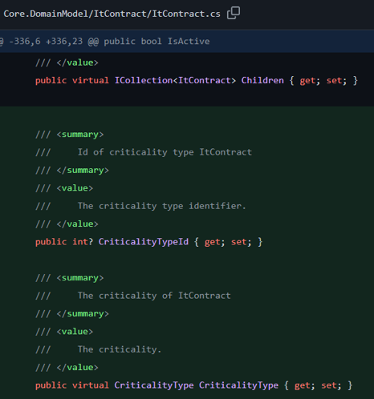


CriticalityType added to the ItContract entity
### **In the DataAccess project**

#### **In the Mapping directory**

Create a new file called `{Choice Type}Map.cs`.
It should inherit from the `OptionEntityMap<{Choice Type}, {RootEntity}>` class, which covers the basic mappings

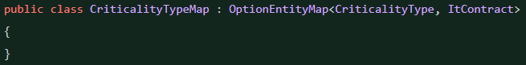


CriticalityType mapping
Add mapping for the newly created _Choice Type_ in the “root” entity mapper

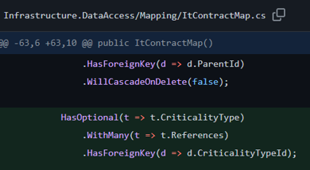

#### **In the KitosContext class**

Add 2 new lines containing the new _entities_:

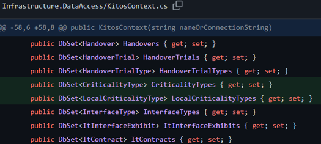

In the `OnModelCreating` method include the Map

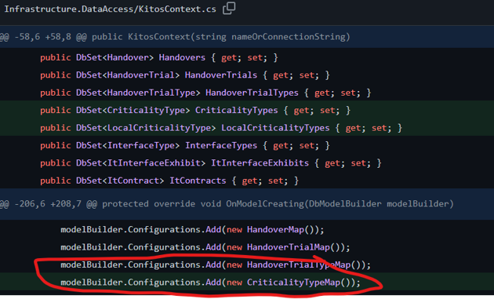

Run the following commands in the _package manager console_ to create and apply a migration:

```
add-migration {migration-name}
update-database
```

### **In the Presentation.Web project**

#### **In the KernelBuilder**

Register the new Option and LocalOption in the _KernelBuilder::RegisterOptions_

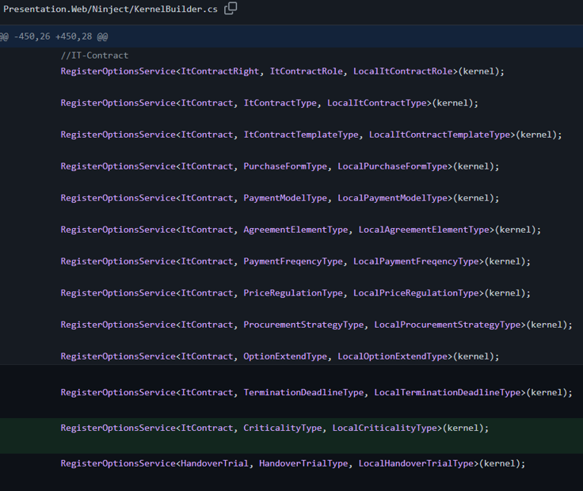


Service registration for criticality
#### **In the Controllers/API/V1/OData/OptionControllers**

Create a new controller called `{Choice Type}Controller.cs`

```
[InternalApi]
public class {Choice Type}Controller : BaseOptionController<{Choice Type}, {RootEntity}>
{
    public {Choice Type}Controller(IGenericRepository<{Choice Type}> repository)
        : base(repository)
    {
    }
}
```

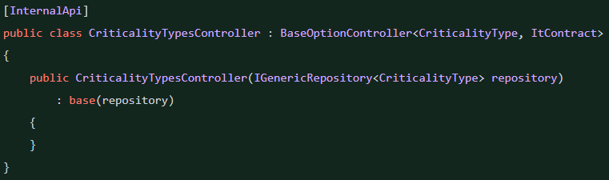

#### **In the Controllers/API/V1/OData/LocalOptionControllers**

Create a new controller called `Local{Choice Type}Controller.cs`

```
[InternalApi]
[ODataRoutePrefix("Local{Choice Type}")] //TODO: Change the RoutePrefix so it includes the correct name
public class LocalCriticalityTypesController : LocalOptionBaseController<Local{Choice Type}, {RootEntity}, {Choice Type}>
{
    public LocalCriticalityTypesController(IGenericRepository<Local{Choice Type}> repository, IGenericRepository<{Choice Type}> optionsRepository)
        : base(repository, optionsRepository)
    {
    }

    [EnableQuery]
    [ODataRoute]
    [RequireTopOnOdataThroughKitosToken]
    public override IHttpActionResult GetByOrganizationId(int organizationId) => base.GetByOrganizationId(organizationId);

    [EnableQuery]
    [ODataRoute]
    public override IHttpActionResult Get(int organizationId, int key) => base.Get(organizationId, key);

    [ODataRoute]
    public override IHttpActionResult Post(int organizationId, LocalCriticalityType entity) => base.Post(organizationId, entity);

    [ODataRoute]
    public override IHttpActionResult Patch(int organizationId, int key, Delta<LocalCriticalityType> delta) => base.Patch(organizationId, key, delta);

    [ODataRoute]
    public override IHttpActionResult Delete(int organizationId, int key) => base.Delete(organizationId, key);
}
```

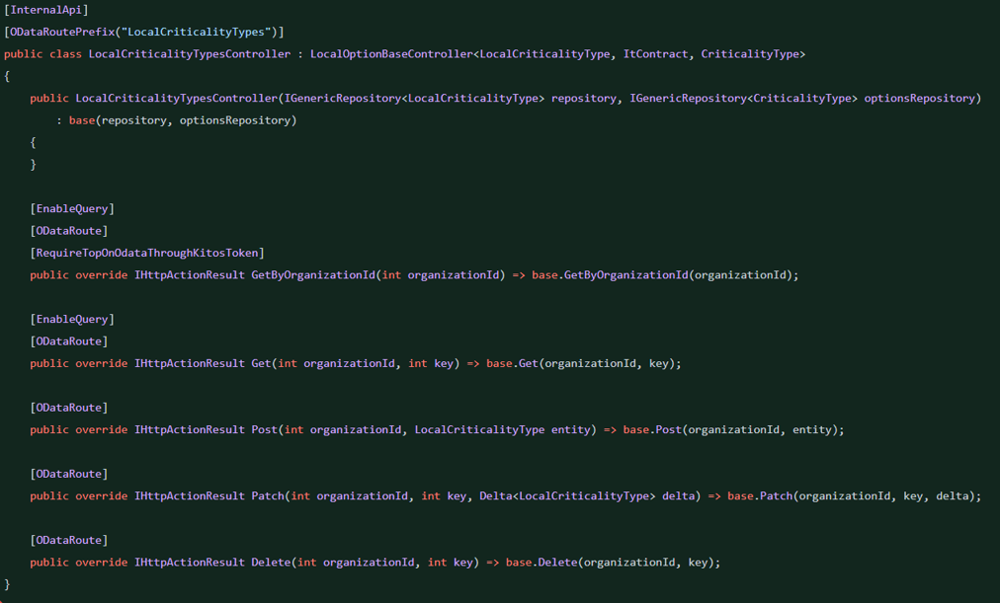

#### WebApiConfig.cs

Extend the ODATA Edm with the new types.

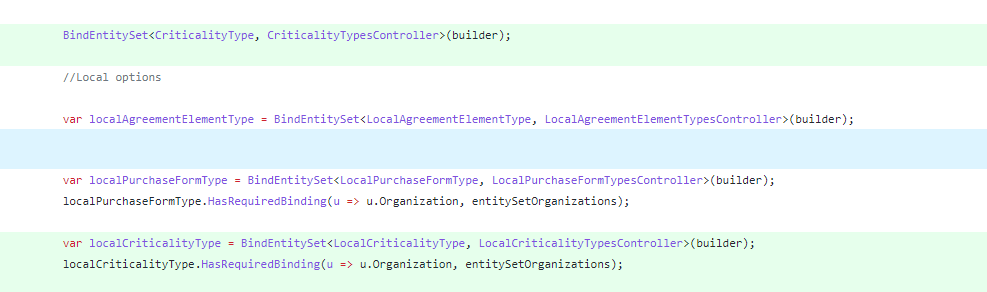

## Frontend

### **In the app/components/**

#### **In the global-admin/global-admin-{root entity}.view.html**

Add a new div, (it will use a directive to create controls for the choice type), and replace the placeholders with the correct data

```
<div data-global-option-list="" dir-id="{Choice Type}Id" title="{Danish Choice Type name}" state="{directive}" data-options-url="odata/{Choice TypeControllerRoutePrefix}" option-type="type"></div>
```

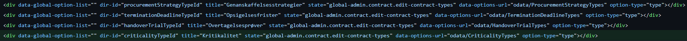

#### **In the local-config/local-config-{root entity}.view.html**

As in the global-admin add a following div

```
<div data-local-option-list="" title="{Danish choice type name}" dir-id="local{ChoiceType}Id" state="{directive}" option-type="{{localChoice Type.{Choice Type}}}" current-org-id="{{currentOrganizationId}}"></div>
```

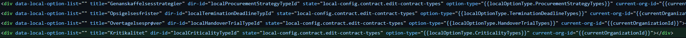

# Adding a choice type to a tab

### Presentation.Web/app/services/localOptionService.ts

Extend the enum and add the enum → OData resource mapping entry.

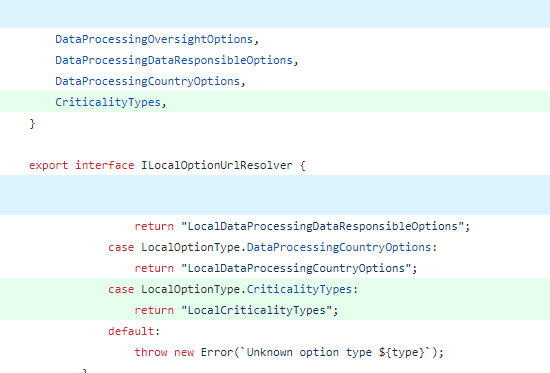


### **In the root controller**

Resolve the available options using the dependency injected `localOptionServiceFactory`

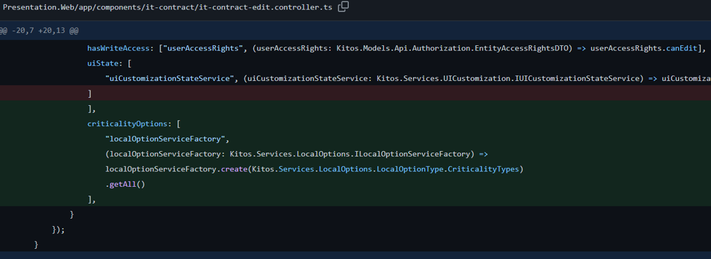

### **In the tab controller**

Add the before resolved service to the constructor, also add `select2LoadingService` if it’s not included

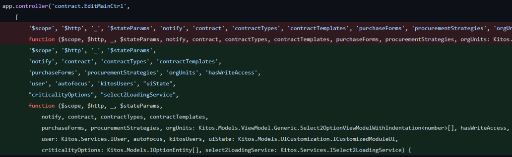

Add a function that creates a SingleSelectSelect2 model. This model allows the directive to access the data.

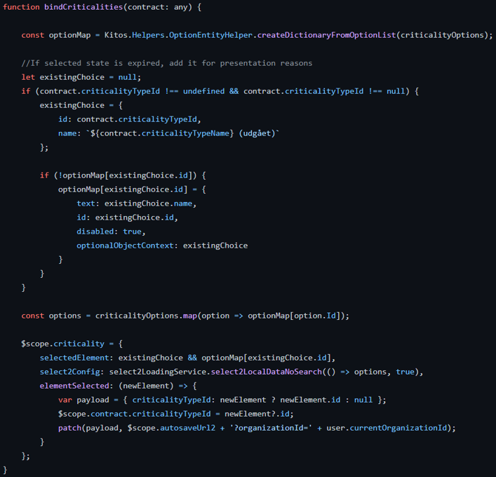

Call the created function in the constructor

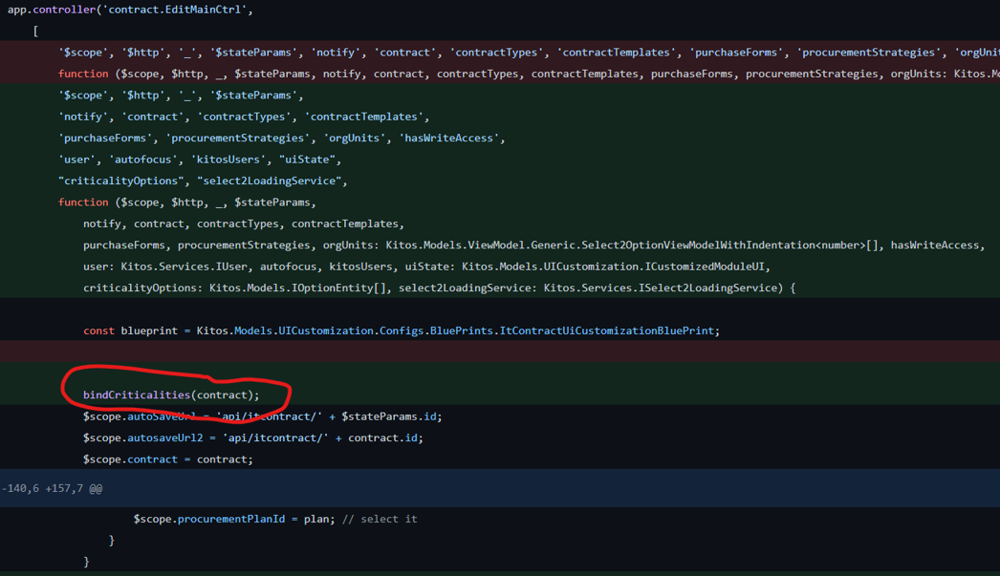

### **In the tab view**

Add the following div

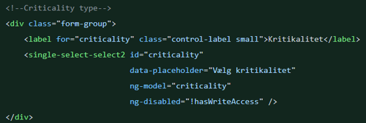

# Adding a choice type to an overview

## Backend

### **In the ApplicationServices/Model/RootEntity directory**

Create a RootEntityOptions class (if it doesn’t exist)

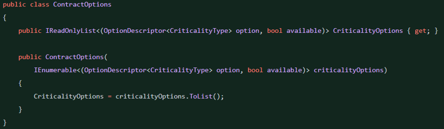

### **In the IRootEntityService**

Add a new method `GetAssignable{RootEntity}Options`

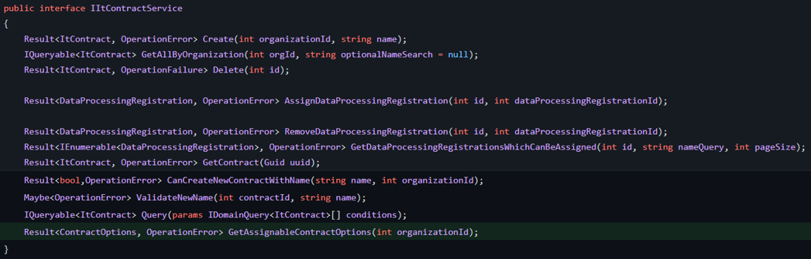

### **In the RootEntityService**

Inject the generic IOptionsService using the RootEntity and ChoiceType as type parameters

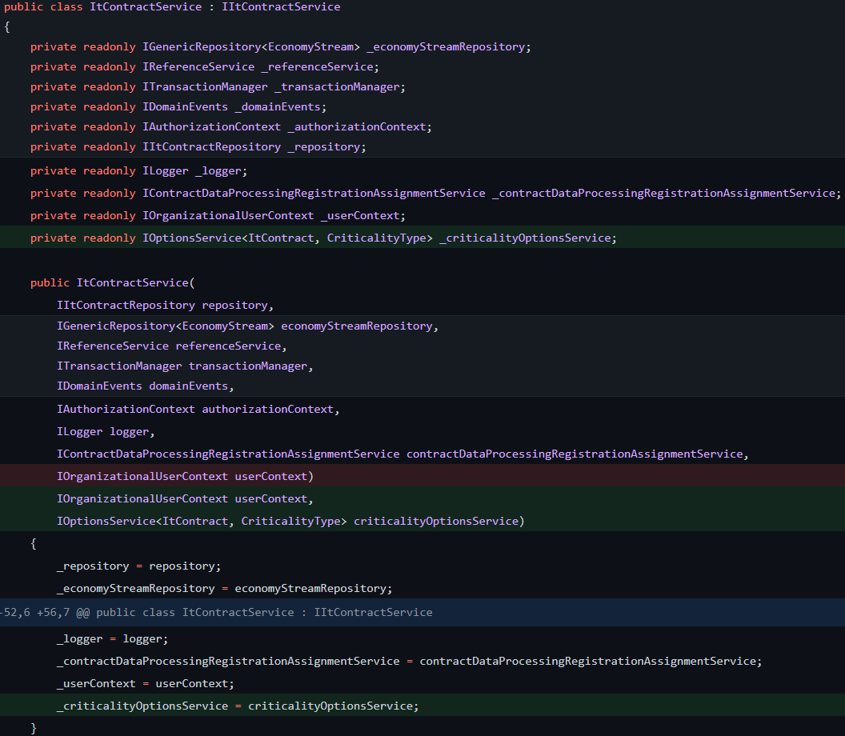

Implement the method defined in the interface

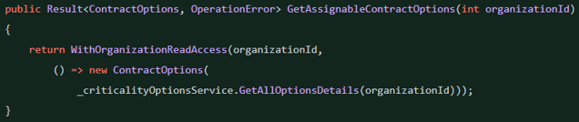

If not implemented, add WithOrganizationReadAccess

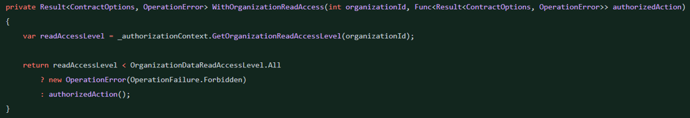

### **In the Presentetation.Web**

#### **In the Models/API/V1/RootEntity**

Add a new model `RootEntityOptionsDTO` containing ChoiceTypeOptions property

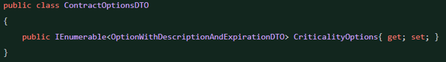

#### **In the Controllers/API/V1/RootEntityController**

Add a new method, which will use a service to get available options

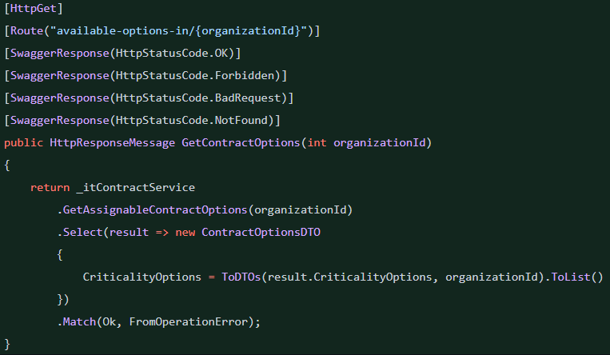

Add mapping methods in the same class

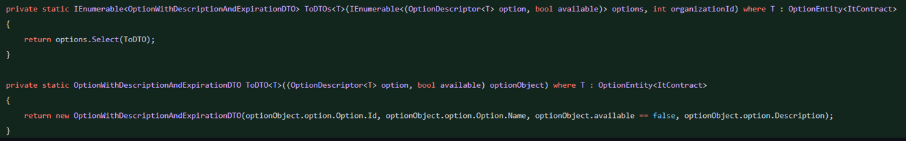

## Frontend

### **In the app/component/rootEntity/overview**

Resolve the options

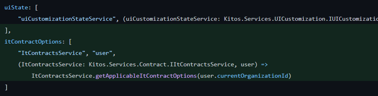

Inject the options in the constructor and create an instance of the OptionTypeViewModel passing the options as a parameter

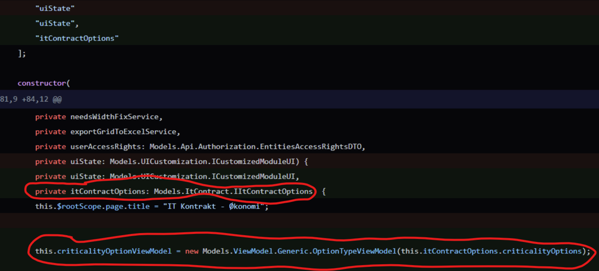

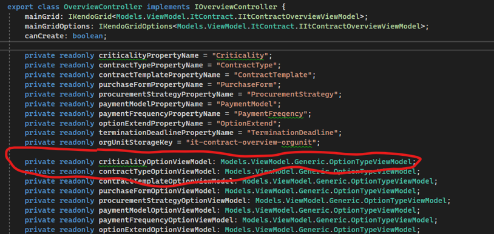

Add the option type column to the kendo launcher

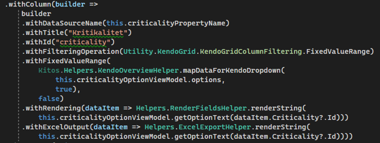

Extend the paramterMap.$orderby and paramterMap.$filter to allow sorting and filtering by the name of the choice type

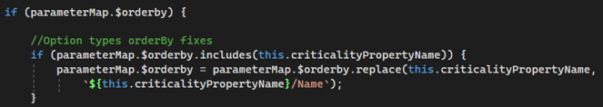

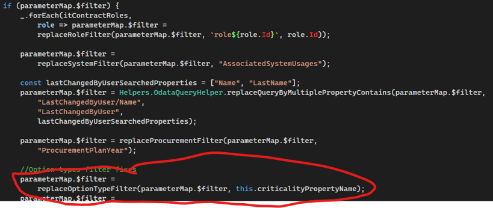

# Adding Choice Type to APIV2

After following the steps covered by the guide [mentioned in the introduction](../api-v2/adding-a-new-data-property-to-an-existin.md), create a new _Controller_ in the `Controllers/API/V2/External/{RootEntity}` directory

```
[RoutePrefix("api/v2/{RootEntity}-{Choice Type}")]
  public class {RootEntity}{Choice Type}V2Controller : BaseRegularChoice TypeV2Controller<{RootEntity}, {Choice Type}>
  {
      public {RootEntity}{Choice Type}V2Controller(IOptionsApplicationService<{RootEntity}, {Choice Type}> optionService)
          : base(optionService)
      {
      }

      /// <summary>
      /// Summary
      /// </summary>
      /// <param name="organizationUuid">organization context for the {Choice Type} availability</param>
      /// <returns>A list of available {RootEntity} {Choice Type}</returns>
      [HttpGet]
      [Route]
      [SwaggerResponse(HttpStatusCode.OK, Type = typeof(IEnumerable<IdentityNamePairResponseDTO>))]
      [SwaggerResponse(HttpStatusCode.Forbidden)]
      [SwaggerResponse(HttpStatusCode.Unauthorized)]
      [SwaggerResponse(HttpStatusCode.NotFound)]
      public IHttpActionResult Get([NonEmptyGuid] Guid organizationUuid, [FromUri] UnboundedPaginationQuery pagination = null)
      {
          return GetAll(organizationUuid, pagination);
      }

      /// <summary>
      /// Summary
      /// </summary>
      /// <param name="{Choice Type}Uuid">{Choice Type} identifier</param>
      /// <param name="organizationUuid">organization context for the {Choice Type} availability</param>
      /// <returns>A uuid and name pair with boolean to mark if the {Choice Type} is available in the organization</returns>
      [HttpGet]
      [Route("{{Choice Type}Uuid}")]
      [SwaggerResponse(HttpStatusCode.OK, Type = typeof(RegularOptionExtendedResponseDTO))]
      [SwaggerResponse(HttpStatusCode.BadRequest)]
      [SwaggerResponse(HttpStatusCode.Unauthorized)]
      [SwaggerResponse(HttpStatusCode.Forbidden)]
      [SwaggerResponse(HttpStatusCode.NotFound)]
      public IHttpActionResult Get([NonEmptyGuid] Guid {opionType}Uuid, [NonEmptyGuid] Guid organizationUuid)
      {
          return GetSingle({opionType}Uuid, organizationUuid);
      }
  }
```

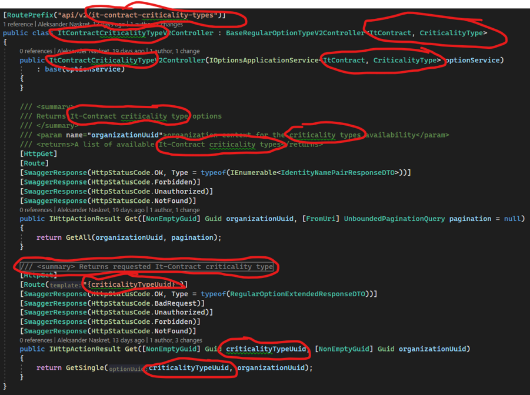


# Testing

### **Integration testing**

#### **In the EntityOptionHelper**

Add a new Resource name

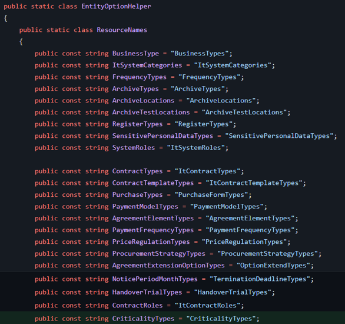

#### **API V1**

##### **In the OptionApiTests**

Add InlineData with the new Choice Type name

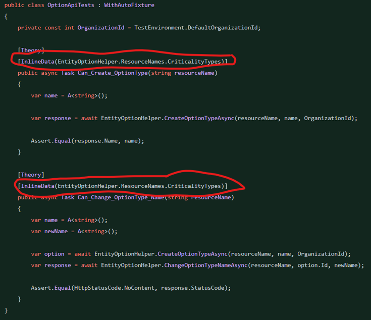

#### **API V2**

##### **In the OptionV2ApiTests**

Add new _Choice Type_ to the `GetRegularResources` method

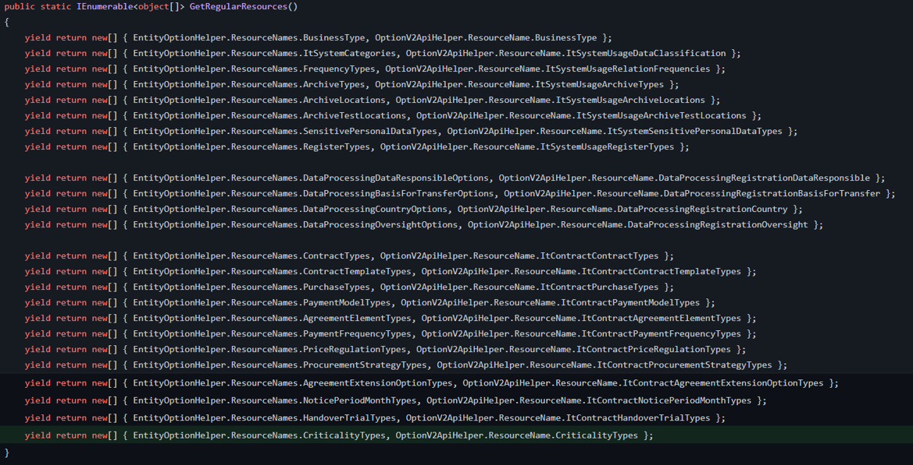
