# Creating an Overview

[Original Confluence page](https://strongminds.atlassian.net/wiki/spaces/KITOS/pages/831291393)

# Introduction

This page describes the process of adding a new overview, and methods of setting it up.

Contents of this page are based on the [KITOSUV-2623](https://os2web.atlassian.net/jira/software/c/projects/KITOSUDV/boards/72?modal=detail&selectedIssue=KITOSUDV-2623), [KITOSUDV-2840](https://os2web.atlassian.net/jira/software/c/projects/KITOSUDV/boards/72?modal=detail&selectedIssue=KITOSUDV-2840), [KITOSUDV-2622](https://os2web.atlassian.net/jira/software/c/projects/KITOSUDV/boards/72?modal=detail&selectedIssue=KITOSUDV-2622) tasks and the connected pull requests: [feature/KITOSUDV-2623](https://github.com/Strongminds/kitos/pull/756), [feature/KITOSUDV-2840](https://github.com/Strongminds/kitos/pull/757) and [feature/KITOSUDV-2622](https://github.com/Strongminds/kitos/pull/758)

## The purpose of the KendoGridLauncher

The `KendoGridLauncher` consolidates the best practice of working with Kendo Grid in KITOS into a managed API, which applies a lot of the defaults and decouples the different overviews from the specific version of Kendo Grid.

# Creating a new overview

## Create a new controller

### In the app/components/entity

Add a new class `entity-name-overview.controller.ts`

The class should look like this (if the view model doesn’t exist look at the next step):

```
module Kitos.{InsertName}.Overview {
    export interface IOverviewController extends Utility.KendoGrid.IGridViewAccess<{ViewModelName}> {
    }

    export class {InsertName}OverviewController implements I{InsertName}OverviewController{
        mainGrid: IKendoGrid<{ViewModelName}>;
        mainGridOptions: IKendoGridOptions<{ViewModelName}>;
        canCreate: boolean;

        public static $inject: Array<string> = [
            "$rootScope",
            "$scope",
            "$state",
            "_",
            "user",
            "kendoGridLauncherFactory",
            //TODO: Inject other required services in the specific context
        ];

        constructor(
            $rootScope: IRootScope,
            $scope: ng.IScope,
            $state: ng.ui.IStateService,
            _: ILoDashWithMixins,
            user,
            kendoGridLauncherFactory: Utility.KendoGrid.IKendoGridLauncherFactory){
        }
    }

    angular
        .module("app")
        .config(["$stateProvider", ($stateProvider) => {
            $stateProvider.state("{entity-name}.overview",
                {
                    url: "/{url}",
                    templateUrl: "app/components/{routeToViewFile}",
                    controller: OverviewController,
                    controllerAs: "{vmName}",
                    resolve: {
                      user: [
                            "userService", userService => userService.getUser()
                        ]
                    }
                });
        }
        ]);
}
```

**NOTE:** Text enclosed in `{..}` should be replaced with something that makes sense in the specific context.

### In the ViewModel folder (ignore if a view model already exists)

Create a new view model, it should contain properties which will be used in the overview.

Example view model used to create `it-contract-overview`:

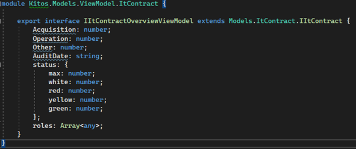

## Create a new view

Add a new class `entity-name-overview.view.html` (in the same folder as the controller)

The newly created view should contain:

```
<div id="mainGrid" data-kendo-grid="{vmName}.mainGrid" data-k-options="{vmName}.mainGridOptions"></div>
```

`{vmName}` represents the conroller name (`controllerAs`)

The controller is expected to expose a grid (`mainGrid`) and an option object (`mainGridOptions`).

## Setting up the overview

### Creating the launcher

In the constructor create a new launcher using `kendoGridLauncherFactory` (remember to replace the names)

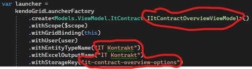

### Getting data

There are 2 options to get data for the launcher, using either `withFixedSourceUrl` or `withUrlFactory` method. Use the first one when the source url is fixed, and the second one when there might be a need to change the query based on e.g. a property.

Basically if any change made by the user will affect the query, use the `withUrlFactory` as this will be called before each request.

Example using the `urlFactory`, the urlParameters are first created, and later an optional change in query is applied

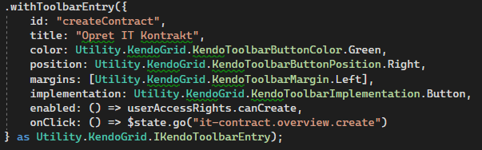

### Standard sorting

To set up the standard property used for sorting call: `withStandardSorting(columnName)` method

**NOTE:** The user can override this so this is only active if the user has not changed it yet or has chosen to reset the view.

### Response parser

If some of the columns require some calculations/reductions/projecctions to be performed on the data before displaying it - e.g. creating a collection - use `withResponseParser()`

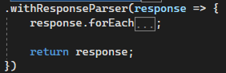

### Adding a toolbar entry

`withToolbarEntry` allows to add a custom entry to the toolbar. Example below creates a new button on the right hand side of the toolbar, and opens a modal on click

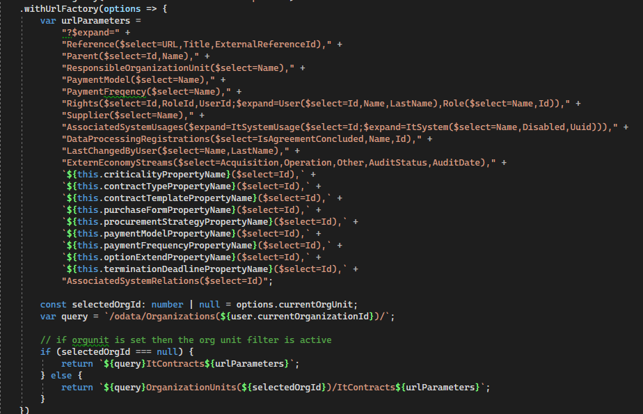

### Adding a new column

In order to add a new column to the launcher apply the `withColumn` method to the launcher

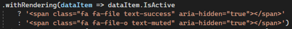

#### withDataSourceName

Specifies the property name in the source data and will affect how kendo (by default) choses to interpret filtering and ordering on the column.

#### withTitle

Sets the column title

#### withId

Sets the column id (used for persisting settings for the column)

#### withDataSourceType

Specifies the data type if it’s a number, boolean or a date (affects displayed controls for ordering and filtering)

#### withRendering

Creates a custom template for each data item

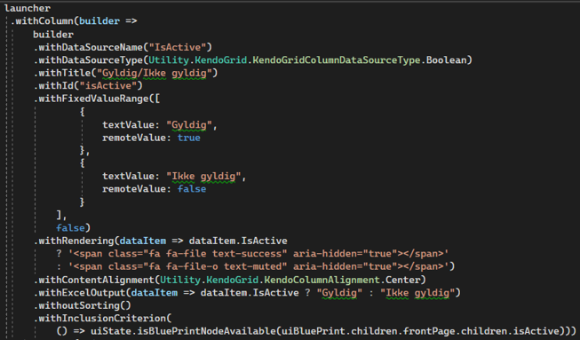

#### withExcelOutput

Creates a custom template for the excel export.

**NOTE:** If the rendering is no different from the one used in the UI, just omit this, as the rendering specified in `withRendering`will be used if no excel specific version has been specified.

#### withoutSorting

Disables sorting on the column. This is typically used if a column covers a collection type on which the OData+EF driver cannot create reasonable SQL.

#### withFilteringOperation

Turns on filtering. Takes KendoGridColumnFiltering enum as an argument.

Options:

* Contains - checks if dataItem contains the userInput
* Data - filters by date
* FixedValueRange - filters by an item in a drop down, required `withFixedValueRange` method
* StartsWith - checks if dataItem starts with the userInput

#### withFixedValueRange

Sets up a dropdown used for filtering, the items should contain _textValue_ and _remoteValue_ properties (it’s possible to also provide _optionalContext_)

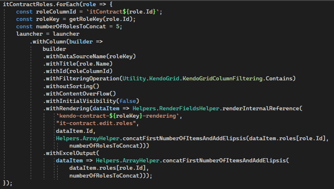

#### withInclusionCriterion

Removes the column if it’s hidden in the UI Customization (adding ui customization to the overview is explained later in this guide)

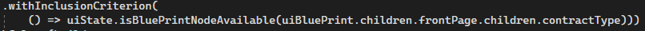

#### withContentAlignment

Uses KendoColumnAlignment enum

#### withSourceValueEchoRendering

Renders the cell using the property specified in the source name - basically it creates the following expression:

`return dataItem["_dataSourcePropertyName_"]`

Use this if the data source is directly renderable without any mutation.

#### withSourceValueEchoExcelOutput

Renders the cell using the property specified in the source name for excel

**NOTES:**

* Use this if the data source is directly renderable without any mutation.
* Do not specify this if the rendering should be the same as the UI rendering. Then only specify that and it will be reused.

#### withContentOverflow

Enables content overflow meaning that long strings will be displayed as “very long string…” and when the user hovers the cell, Kendo will show the entire string.

## Adding role columns

Some overviews may have role columns added to them. First get all available roles, next loop over them and create a new column for each of them

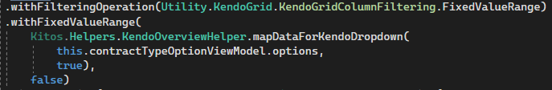

## Applying filter fix

In some cases standard filtering might not work correctly, in that case a filter “fix” should be applied.

First add `withParameterMapping` method to the launcher.

Inside check if any filter exists for the `parameterMap`, if it does apply the fix

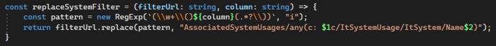

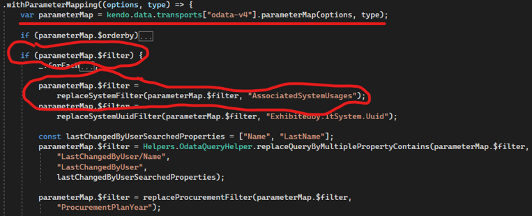

## Applying orderby fix

In the same mehtod as in the filtering there can be applied an ordedby fix

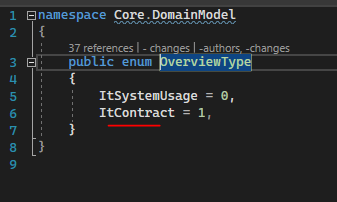

## Enabling local admin customization

This feature allows the local admin to create the “default settings” for all users in the organization. Users can change that locally but will be notified that they are now using a non-standard configuration.

### In the backend

Extend the enum:

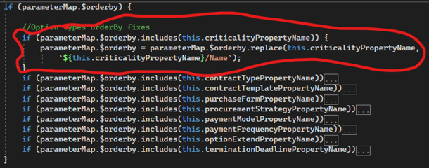

### Frontend: In the KendoOrganizationConfigurationDTO.ts

Extend enum so it includes the name of the overview

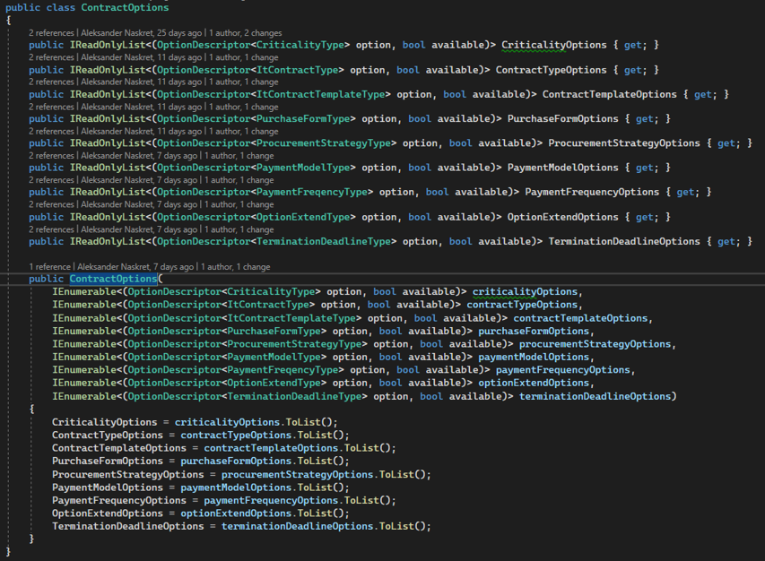

### Frontend: In the overview

Add `withOverviewType` which takes the new member as an argument

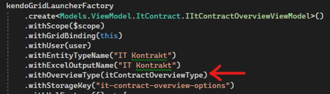

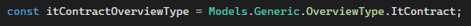

## Choice Types

### Backend

#### In the Core.ApplicationServices.Model.Entity

Add `{Entity}Options` class, this class will contain all of the available choice types for the overview

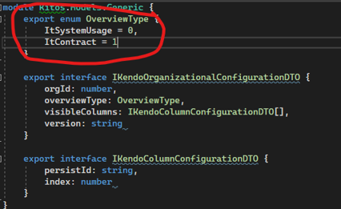

#### In the IEntityService

If it doesn’t already exist add a new method which gets the options

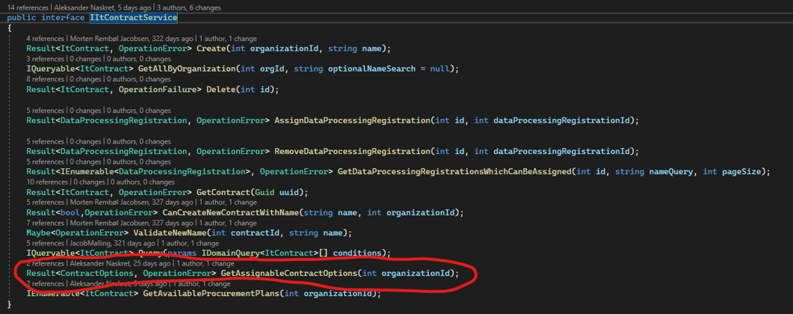

#### In the EntityService

Inject an optionsService for each of the options required by the overview

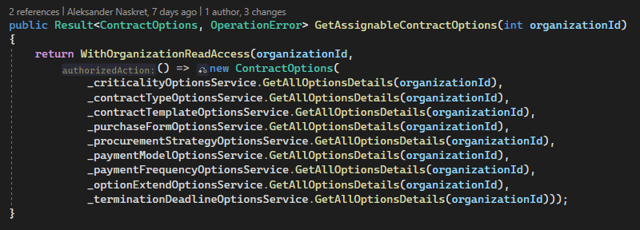

(if it doesn’t exist) create `WIthOrganizationReadAccess` method

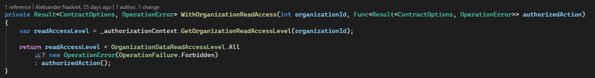

Implement the method that was added to the interface

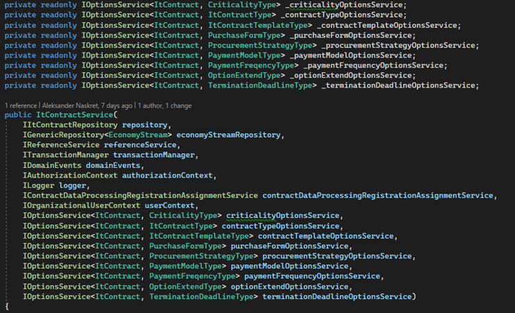

#### In the EntityController

Add a new method

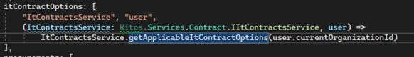

Add mapping methods

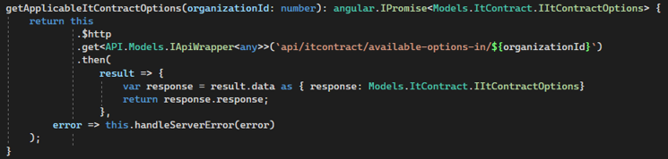

### Frontend

#### In the {Entity}Service

Extend service interface by adding a new method

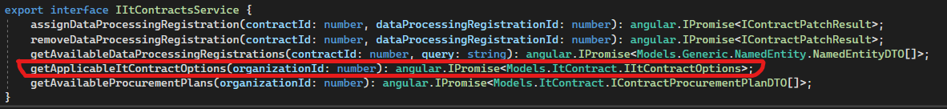

Implement the method

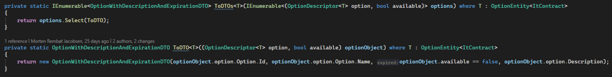

### In the Overview

Call the created method in the resolve

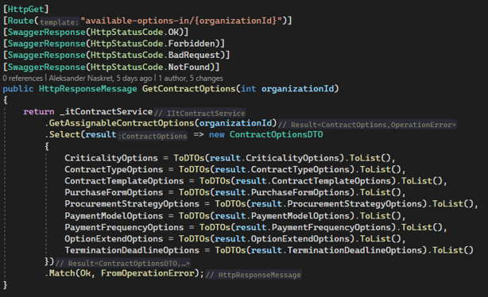

Inject options in the constructor

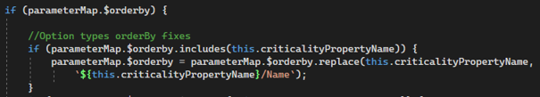

Declare a new optionViewModel property (separete property for each of the choice types in the “Options”)

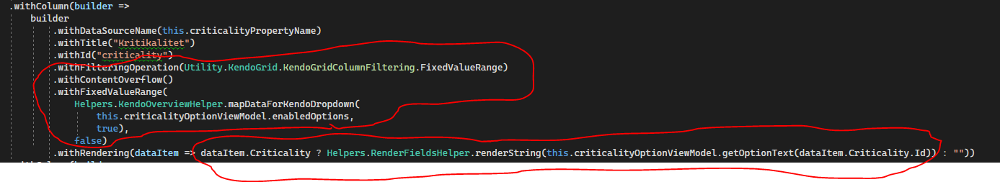

Inside of the constructor create a new instance of the OptionTypeViewModel and assign it to the created property

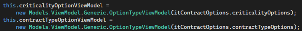

Add a new column to the launcher

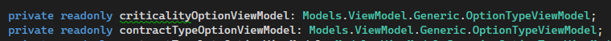

Extend the parameterMapping orderby

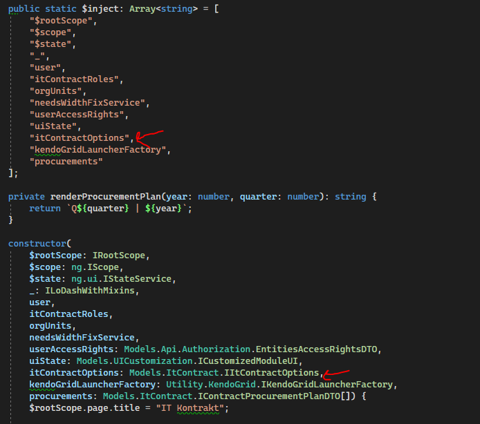

Extend the parameterMapping filter

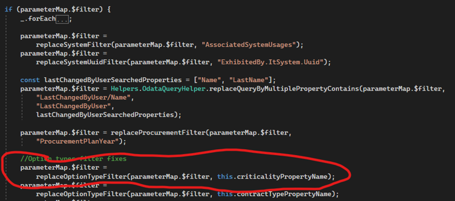

if the `replaceOptionTypeFilter` method doesn’t exist create it

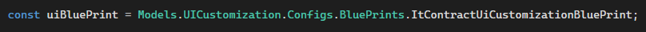

## Adding UI customization state

UI customization in KITOS allows for hiding/showing certain fields/groups ([Linked page](../../design-documentation/customization/local-ui-customization.md)). To add uiState to the overview:

### Add a new item to _resolve_

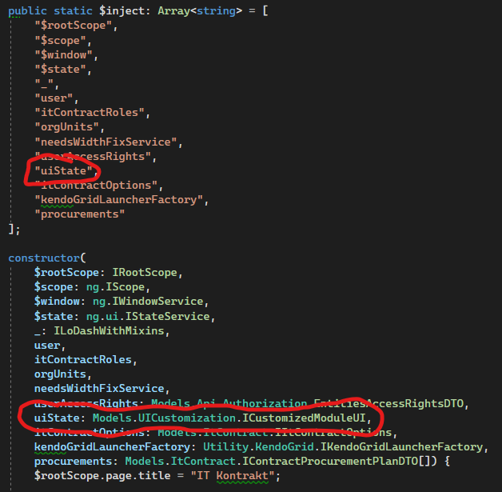

### Inject UI State

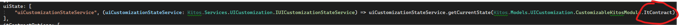

### Create blueprint variable

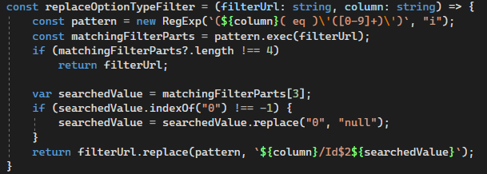

### Apply the uiState

To apply the uiState add `withInclusionCriterion` like mentioned in the “Add a new column” section of this guide

### More details

See [Linked page](../../design-documentation/customization/local-ui-customization.md)
