# Creating and exposing an "overview read model"

[Original Confluence page](https://strongminds.atlassian.net/wiki/spaces/KITOS/pages/838303745)

# Introduction

This documents presents a step-by-step procedure to extend KITOS with a new search-optimized read model intended for an overview page.

For reasoning behind this concept, please read the architectural description:[Linked page](../../architecture-decision-log/read-models-for-the-overview-context.md)

## Example Pull Request

<https://github.com/Strongminds/kitos/pull/773>

The objects used in this guide will draw from that pull request, though the amount of details will be reduced to keep the guide focused on the principles rather than trying to cover all different mapping situations.

# Procedure

## Create the read model domain object

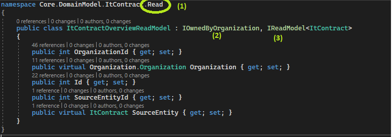

1. Place the code in a sub-namespace (`Read`) to that of the domain object it is a projection of.
2. `IOwnedByOrganization` indicates that the read model is a local object belonging to an organization. It adds the `OrganizationId` as well as the `Organization`property and enables queries by organization id.
3. `IReadModel<>` adds the necessary properties to make this object a read model - a projection based on a source entity. It adds the `Id`property (from `IHasId`) which is just the primary key of the read model’s row, but it also adds the `SourceEntity` / `SourceEntityId` which sets up the ownership of the read model to that of the `SourceEntity`. We can use this property to setup the right cascade path, when we add the Entity Framework map later on.

## Entity Framework

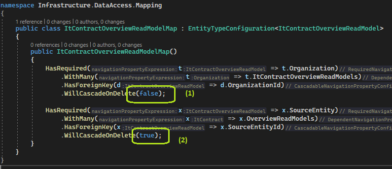

1. Cascade is set to false for the organizational relationship
2. Cascade is set to true on the source entity, ensuring that deleting the source entity will also delete the associated read models.

### Search optimized mappings

When the read-model is extended further, remember that the purpose of the read model is to serve the query needs of users navigating the overview pages. For that reason, we must apply proper indexing the different properties as well as providing “special” concatenated fields to enable “sorting” on collection fields.

#### Example 1: Indexing on regular “simple property”

In this example, we extend the model with the `Name` property, which must contain the value of the `Name` property of the source `ItContract` object.

In `ItContractOverviewReadModelMap` we add the following mapping:

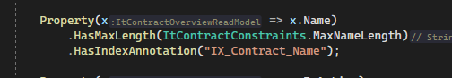

Notice the following:

* We apply the same length constraint to the column as the one applied on the source object. This allows to add an index to the `varchar()` column.
* We add an index with the following notation: `[IX | UX]_{SourceName}_{PropertyName}`

    * `UX`: Unique index
    * `IX`: Index

#### Example 2: Referencing an option type

In this example, we extend the model with a reference to the `ContractType` used by the `ItContract`

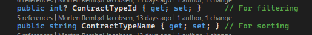

Notice that we don’t add a reference to the real type but just pick what we need for the read model. For more info about this see [Linked page](../../architecture-decision-log/read-models-for-the-overview-context.md)

* The `Id` of the option type is used when filtering

    * In the front-end we will render a combobox, where the value used during querying will be the integer value that points to the `Id`

* The `Name` property is used to allow `$orderBy` to sort by the name of the option type.

:question:  **Why not just use the Name then?**: SQL server performs filtering operations faster on integer values compared to varchar. Also, there is no constraint preventing two “names” being the same (even though it would make no sense), whereas the `Id` is guaranteed to be unique.

In the `ItContractOverviewReadModelMap` we add the following:

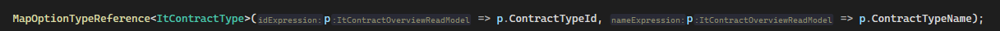

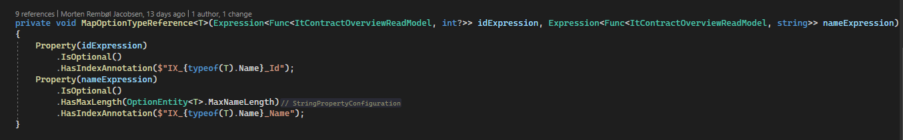

Notice that indexes are applied to both properties.

#### Example 3: Referencing a collection of assignments which must be both filterable and sortable

In this example, we extend the model with a collection of referenced `DataProcessingRegistration` references. We want to be able to do the following:

* Apply `$orderby`
* Filter by `name` of the referenced `DataProcessingRegistration`
* In the front-end, render internal links for each entry in the collection.

From the requirements above, we know we need the following:

* A concatenation field, which enables `$orderby` to be applied on the collection
* A collection of “reference read models” which allows us to

    * Store the original `Id` to enable link generation
    * Search optimized in by `Name`

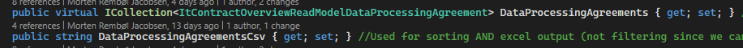

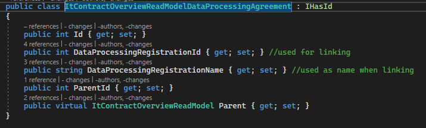

The `DataProcessingAgreementsCsv` is the concatenation field and will be used when `$orderby` is to be applied.

The collection `DataProcessingAgreements` holds the reference information (`Id`) as well as a copy of the original name which we can apply length constraints to and hence add an index.

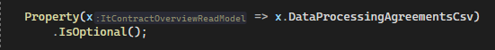

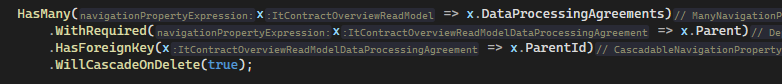

Notice that we don’t know the max size of the `DataProcessingAgreementsCsv`, so we cannot add an index to that field. That is why we store the name in the collection.

In `ItContractOverviewReadModelDataProcessingAgreementMap` we add the following:

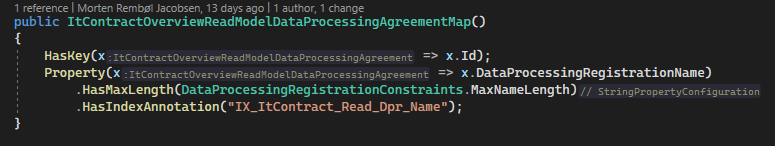

### Extending KitosContext.cs

Add the dbset

Add the map:

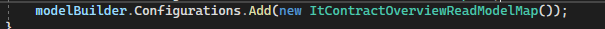

### Add the migration

* In Visual Studio, open Package Manager Console and set Default Project:

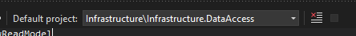

* Then run the command

`Add-Migration Add_ItContractOverviewReadModel`

Then run the following command

`Update-Database`

## Add the repository

In In `Core.DomainServices`

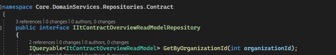

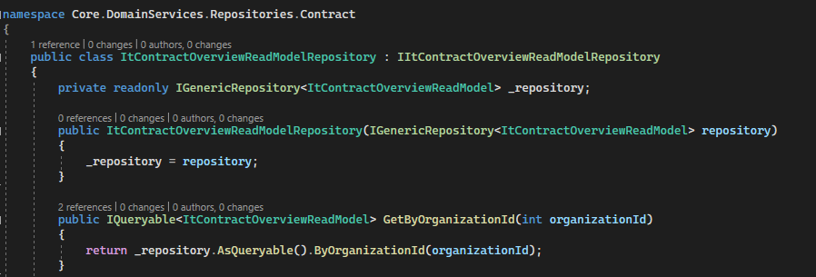

In `KernelBuilder::BindDataAccess()`

## Add the application service

In `Core.ApplicationServices`

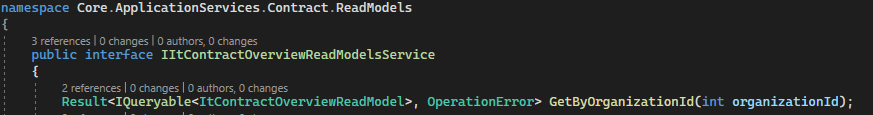

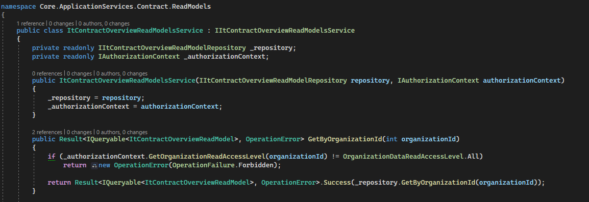

In `KernelBuilder::RegisterServices()`:

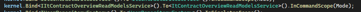

## Expose the read model through odata

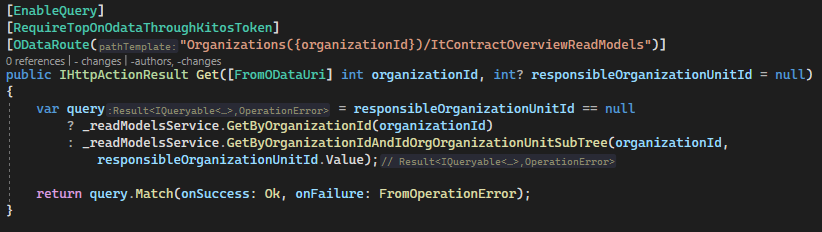

In `WebApiConfig.cs`

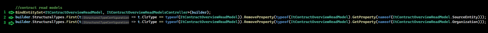

1. Bind the model to the controller
2. Remove source object property from OData EDM model (prevents expand)
3. Remove source organization property from OData EDM model (prevents expand)

## Verify connection to controller

* Start kitos locally
* Login
* Invoke the GET endpoint: `https://localhost:44300/odata/Organizations(1)/ItContractOverviewReadModels`
* At this point no data is mapped, so the result is expected to be OK but empty:

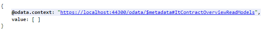

Expected initial result
## Create the read model update mapper

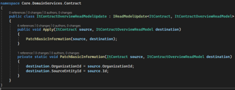

In `KernelBuilder::RegisterServices()`

The purpose of the “Read model mapper” is to merge data from the source into a read model.

The read model may have been loaded from the database or may be new. The code must not make assumptions around this and treat it like a “merge” every time.

## Unit-test the read model update mapper in isolation

In order to maintain the working state of the read model updates, create a unit test for the read model update class and perform thorough white-box testing through that.

## Create the event handler used to subscribe to relevant changes and trigger read model updates (sync/async)

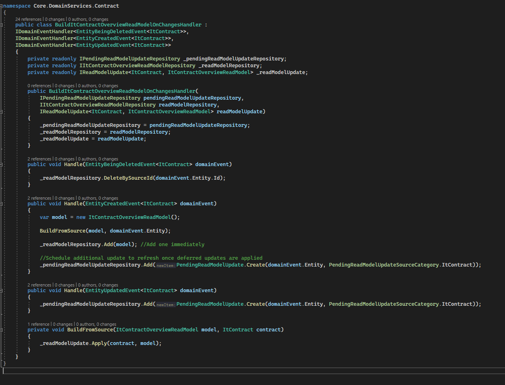

In `KernelBuilder::RegisterDomainEventsEngine()`

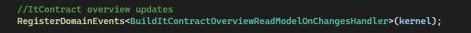

The helper `RegisterDomainEvents` will register all instances of`IDomainEventHandler<>` exposed by the provided type.

### Deferred vs immediate updates

When change events are handled, the handler may choose to either:

* Apply the changes to the database immediately

    * This is the case for

        * Creations of the source entity
        * Deletions of the source entity

* Track the changes for deferred processing in the background

    * This is the case for every other change, since we want to defer as much processing to the background as we possiby can, since we want to reduce the latency, impacting the client request, as much as possible.

## Hangfire: Add read model rebuild scheduling job (rebuilds based on changes in dependencies)

The overview read models typically display properties such as “name” from referenced entities as well as displaying data which is derived from registrations in other modules (e.g. system relations involving the contract). For that reason we use the [event handler](creating-and-exposing-an-overview-read-m.md)) to track changes - not only to the source entity but also to entities which may impact the overview read model.

In order to reduce “changes to dependencies” to “changes to existing read models”, we add a new job:

* In In `StandardJobIds` add a new id:

* Create an implementation

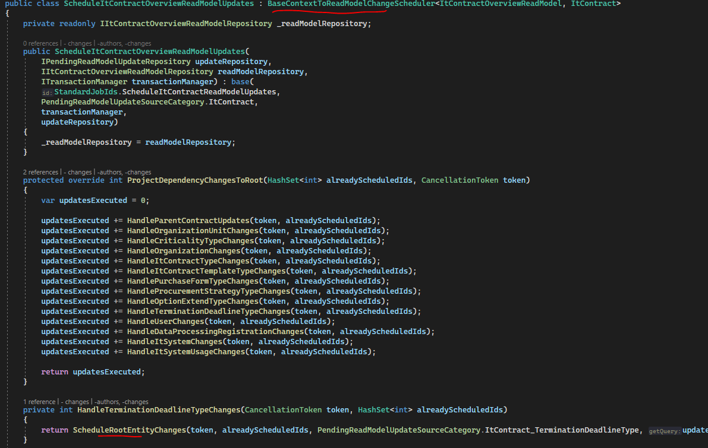

The role of this job is to interpret all tracked changes and convert them into changes to the source object, which will then be picket up by the “[rebuild” job.](creating-and-exposing-an-overview-read-m.md)

* In `KernelBuilder::RegisterBackgroundJobs()`

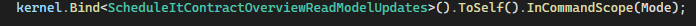

* In `IBckgroundLauncher`

* In `BackgroundJobLauncher`

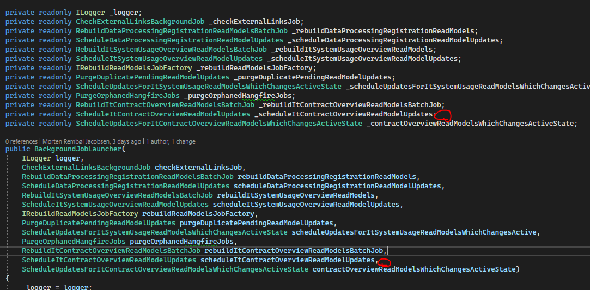

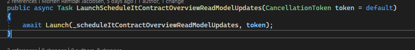

* In `KeepReadModelsInSyncProcess`

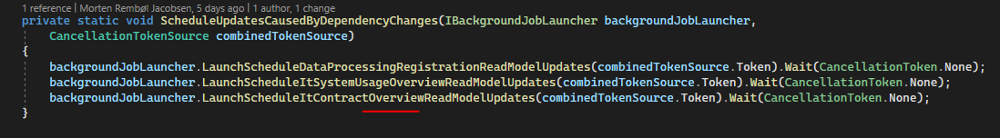

## Hangfire: Build read model bg-job

* In `StandardJobIds` add a new id:

* Add a job implementation:

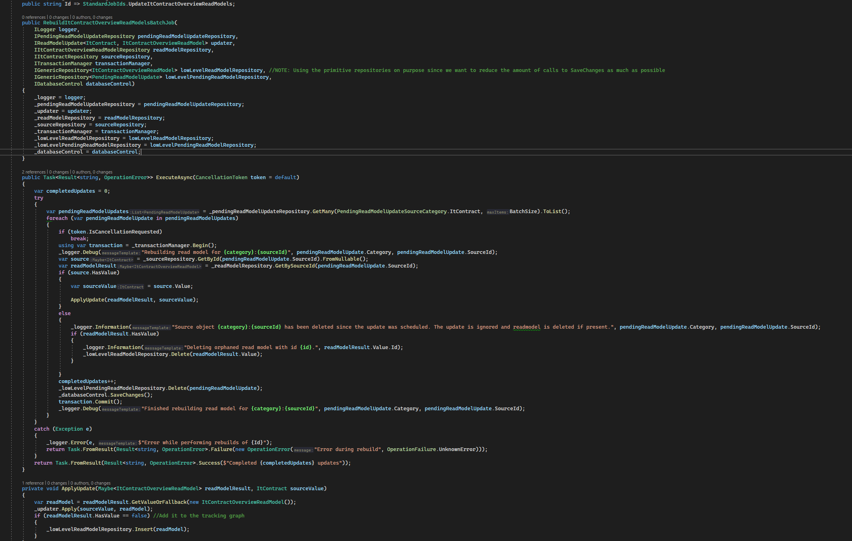

* In `KernelBuilder::RegisterBackgroundJobs()`

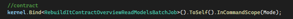

* In `IBckgroundLauncher`

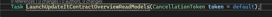

* In `BackgroundJobLauncher`

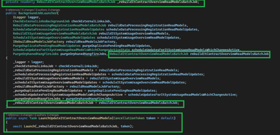

* In `KeepReadModelsInSyncProcess`

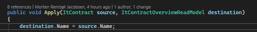

## Hangfire: Full rebuild job

The full rebuild job is typically used following a deployment where columns have been added or intepretations to existing columns have changed. The full-rebuild job will schedule a read model update to all source entities.

* In `ReadModelRebuildScope.cs` add the new scope (ItContract in the example).

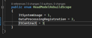

* In `StandardJobIds` add an Id for the job:

* In `RebuildReadModelsJobFactory` extend the switch case with the new scope:

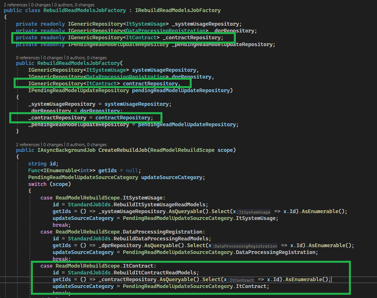

* In `Startup.cs` add an additional on-demand job:

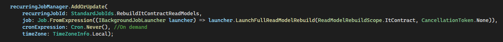

## Verify that simple CRUD operations are reflected in the API output

### Create

* Open KITOS and create an instance of the object

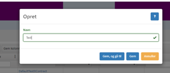

* Navigate to the object
* Note the `Id` property in the URL in the browser
* Visit [https://localhost:44300/odata/Organizations(1)/ItContractOverviewReadModels](https://localhost:44300/odata/Organizations(1)/ItContractOverviewReadModels)
* Verify that the object is present in the list (check the `SourceEntityId` property which maps to the `Id` property noted earlier)

### Update

* Go to the database in MSSQL Management Studio
* Locate the table for the read models and delete all
* Open kitos and navigate to an object
* Validate that [https://localhost:44300/odata/Organizations(1)/ItContractOverviewReadModels ](https://localhost:44300/odata/Organizations(1)/ItContractOverviewReadModels)returns an empty list
* Change the object
* Validate that [https://localhost:44300/odata/Organizations(1)/ItContractOverviewReadModels](https://localhost:44300/odata/Organizations(1)/ItContractOverviewReadModels) contains the object

    * :exclamation: A few seconds may pass since updates are applied asynchronously (as opposed to deletions and creations which are instant).

### Delete

* Open KITOS and navigate the object
* Note the Id property in the URL in the browser
* Delete the object
* Navigate to [https://localhost:44300/odata/Organizations(1)/ItContractOverviewReadModels](https://localhost:44300/odata/Organizations(1)/ItContractOverviewReadModels)
* Validate that the object is no longer there (object with the `SourceEntityId` property noted earlier (as `Id`) should not be in the list)

## Hangfire jobs to re-trigger rebuilds based on evens such as data of year (contract expiration etc)

Some entities such as `ItContract` have state which changes based on non-client related changes. In the case of `ItContract` the state of the `IsActive` property depends on “time”, so in order to trigger daily re-evaluations, create a background job:

* In `StandardJobIds` add

* Add an implementation of the job

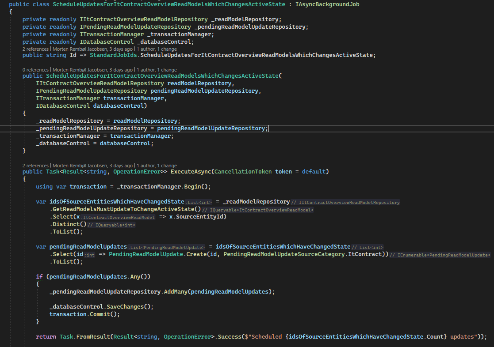

* In `KernelBuilder` add

* In `BackgroundJobLauncher`

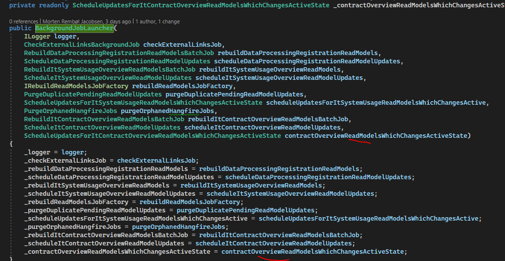

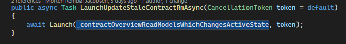

* In `Startup.cs` add:

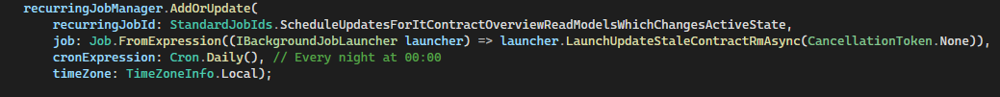

## Integration tests

In order to validate that data mapping is exposed correctly through the API, create an API integration test which - as a minimum - tests:

* Pagination
* Simple filter operations (validates that querying is possible)
* That properties mapped are actually exposed correctly

Additionally the test may be used to validate that:

* Changes to dependencies are picked up and reflected in the read models after read model processing has finished.

For inspiration see:

* `DataProcessingRegistrationReadModelsTest`
* `ItSystemUsageOverviewReadModelsTest`
* `ItContractOverviewReadModelsApiTest`

## Adding a new property so we have something to consume in the UI

In this example, we will add the name of the contract as a simple flat property:

* Extend the `ItContractOverviewReadModel` with the `Name property`

* Update the `ItContractOverviewReadModelMap`, adding the same constraints to the name as that of the source while also adding an index.

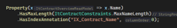

* Update the `ItContractOverviewReadModelUpdate`

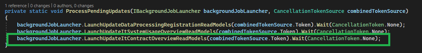

* Add an EF migration to the project
* Update the database
* Start Kitos
* Open an object and change the name
* Verify that the new name is reflected in [https://localhost:44300/odata/Organizations(1)/ItContractOverviewReadModels](https://localhost:44300/odata/Organizations(1)/ItContractOverviewReadModels)
