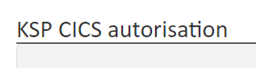
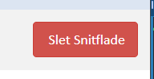

# 00 Crosspage (remove usage)

[Original Confluence page](https://strongminds.atlassian.net/wiki/spaces/KITOS/pages/964329543)

## Title

Shows `interface.name`

# Actions

* Delete

    * API: `DELETE /api/v2/it-interfaces/{systemUuid}`
    * Enabled if accesscontrol contains `delete`

