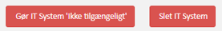
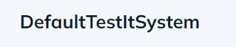
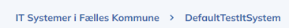

# 00 System cross page features

[Original Confluence page](https://strongminds.atlassian.net/wiki/spaces/KITOS/pages/964296754)

# Title

shows

`systemContext.name`

# Breadcrumbs

# Actions

* If system is Available:

    * Take into usage button
    * or make unavailable button?

* If system is in usage:

    * Delete usage button

* If system is unavailable

    * Delete system button (if no usages)
    * or make available button

* Delete

    * API: `DELETE /api/v2/it-systems/{systemUuid}`
    * Enabled if accesscontrol contains `delete`

* Make system unavailable

    * API: `PATCH /api/v2/it-systems/{systemUuid}`
    * Property: `deactivated`
    * Enabled if accesscontrol contains `edit`

