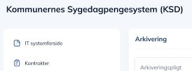
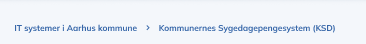

# 00 Cross page features

[Original Confluence page](https://strongminds.atlassian.net/wiki/spaces/KITOS/pages/877068335)

# Title

shows

`systemContext.name`

# Breadcrumbs

# Actions

* Delete

    * API: `DELETE /api/v2/it-system-usages/{systemUsageUuid}`
    * Enabled if accesscontrol contains `delete`

