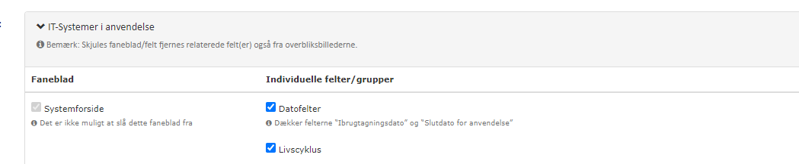

# 01 Front page (it-system usage)

[Original Confluence page](https://strongminds.atlassian.net/wiki/spaces/KITOS/pages/876576844)

# Jira Links

<https://os2web.atlassian.net/browse/KITOSUDV-4054>

<https://os2web.atlassian.net/browse/KITOSUDV-4062>

<https://os2web.atlassian.net/browse/KITOSUDV-4070>

<https://os2web.atlassian.net/browse/KITOSUDV-4063>

<https://os2web.atlassian.net/browse/KITOSUDV-4064>

<https://os2web.atlassian.net/browse/KITOSUDV-4065>

<https://os2web.atlassian.net/browse/KITOSUDV-4066>

<https://os2web.atlassian.net/browse/KITOSUDV-4067>

<https://os2web.atlassian.net/browse/KITOSUDV-4061>

# General requirements

[Linked page](../../../shared-components/choice-types-in-kitos.md)

[Linked page](../../../shared-components/help-text-dialogs.md)

[Linked page](../../../shared-components/data-change-toast-messages-with-optional.md)

# UI Customization keys

# API

`[GET | PATCH] /api/v2/it-system-usages/{systemUsageUuid}`

Write access info: <https://os2web.atlassian.net/browse/KITOSUDV-4062>

# Component specific requirements

## Tab: “Lokal data fra kommunen”

### Block: IT System information

| **UI name** | **Inputtype** | **READ path** | **WRITE path** | **Constraints** |
| --- | --- | --- | --- | --- |
| Aktivt/Ikke aktivt | Colored status marker | `validity.[valid]` |  | Read only |
| Systemnavn (lokalt) | String | `general.localCallName` | `general.localCallName` | Length: \[0,100\] |
| System ID (lokalt) | String | `general.localSystemId` | `general.localSystemId` | Length: \[0,200\] |
| Version | String | `general.systemVersion` | `general.systemVersion` | Length: \[0,100\] |
| Antal brugere | Constrained tuple choice | `general.numberOfExpectedUsers` | `general.numberOfExpectedUsers` | Initial value: `null`.  Valid range: `{[0,9],[10,50],[50,100],[100,null]}` |
| Klassifikation af data i systemet | Choice type `/api/v2/it-system-usage-data-classification-types` | `general.dataClassification` | `general.dataClassificationUuid` | One of the available choices or `null` |
| Beskrivelse | String | `general.notes` | `general.notes` | None |

### Block: Systemanvendelse

| **UI name** | **Inputtype** | **READ path** | **WRITE path** | **Constraints** |
| --- | --- | --- | --- | --- |
| Taget i anvendelse af | Readonly string | `createdBy` |  | Readonly |
| Sidst redigeret (bruger) | Readonly string | `lastModifiedBy` |  | Readonly |
| Sidste redigeret (dato) | Readonly DD-MM-YYY string | `lastModified` |  | Readonly |
| Livscyklus | Enum choice | `validity.lifeCycleStatus` | `validity.lifeCycleStatus` | Enum choice. Initial value will be null. “undecided” renders as “<empty choice>” |
| Ibrugtagningsdato | Date | `validity.validFrom` | `validity.validFrom` | Cannot exceed end date |
| Slutdato for anvendelse | Date | `validity.validTo` | `validity.validTo` | Cannot proceed start date |
| Status | Readonly status with optional tooltip “info icon” (see design) | `validity.[valid]` Tooltip enriched from: `validity.validAccordingToValidityPeriod` `validity.validAccordingToLifeCycle` `validity.validAccordingToMainContract` |  | Readonly |

## Tab: “Data fra IT Systemkataloget”

Based on `systemContext.Uuid` the IT-System can be resolved from

`GET /api/v2/it-systems/{uuid}`

_**All data on this tab is read only - always**_

### Block: “IT System information”

| **UI name** | **Inputtype** | **READ path** | **Constraints** |
| --- | --- | --- | --- |
| Tilgæneligt/Ikke tilgængeligt | Colored status | `deactivated` |  |
| Systemnavn | strimg | `name`  |  |
| Overordnet system | string | `parentSystem.name` | Optional |
| Tidligere systemnavn | string | `formerName` |  |
| Rettighedshaver | string | `rightsHolder.name` | Optional |
| Forretningstype | Choice type from `/api/v2/business-types` |  | Obsolete choice rendered by common component rules for choice types |
| Synlighed | Enum | `scope` |  |
| UUID | string | `Uuid` |  |
| Rigsarkivets vejledning til arkivering | Enum + text field | `recommendedArchiveDuty.id` `recommendedArchiveDuty.comment` | optional help text with link to “rigsarkivet” below field only shown if a choice has been made |
| Referencer vedr. systemet | Link | `urlReference` |  |
| Beskrivelse | string | `description` |  |

### Block: “KLE”

| **UI name** | **Inputtype** | **READ path** | **Constraints** |
| --- | --- | --- | --- |
| ID | Grid, column 1 | `kle[*].name` |  |
| Navn | Grid, column 2 | `mapDescription(kle.uuid)` |  |

\*_Based on lookup in dictionary created from:_ `/api/v2/kle-options`
