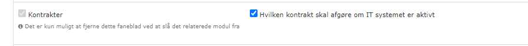

# 02 Contracts

[Original Confluence page](https://strongminds.atlassian.net/wiki/spaces/KITOS/pages/881885185)

# Jira Links

<https://os2web.atlassian.net/browse/KITOSUDV-4193>

# General requirements

[Linked page](../../../shared-components/choice-types-in-kitos.md)

* Also note sections specifically around roles

[Linked page](../../../shared-components/help-text-dialogs.md)

[Linked page](../../../shared-components/data-change-toast-messages-with-optional.md)

# UI Customization keys

# API

Data:

`[GET | PATCH | DELETE] /api/v2/it-system-usages/{systemUsageUuid}`

Permissions:

`GET /api/v2/it-system-usages/{systemUsageUuid}/permissions`

# Component specific requirements

## List of associated contracts (with details needed for overview)

`GET /api/v2/it-contracts?systemUsageUuid={usage.uuid}`

| **UI name** | **Field type** | **READ path** | **WRITE path** | **Constraints** |
| --- | --- | --- | --- | --- |
| IT-Kontrakt | Internal Link (to the contract) | `name` |  | Read only |
| Kontrakttype | Choice type `GET /api/v2/it-contract-contract-types` | `general.contractType` |  | Read only |
| Leverandør | String | `supplier.organization` |  | Read only |
| Drift | Boolean | `general.agreementElements` :warning: The current implementation checks for the presence of a choice specifically named `Drift`.  We don’t have a good solution for it since it relies on a user defined choice (global admin can rename it and break the functionality) |  | Read only |
| Indgået | Date | `validity.validFrom` |  | Read only |
| Udløber | Date | `validity.validTo` |  | Read only |
| Opsagt | Date | `termination.terminatedAt` |  | Read only |

## Main contract

`GET /api/v2/it-system-usages/{usageUuid}`

| **UI name** | **Field type** | **READ path** | **WRITE path** | **Constraints** |
| --- | --- | --- | --- | --- |
| Hvilken kontrakt skal afgøre om IT Systemet er aktivt: | Choice of contracts | `general.mainContract` | `general.mainContractUuid` | Read only |
| Validity indication | Boolean | (on the contract) `validity.valid` |  | Read only |
