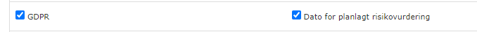

# 04 GDPR

[Original Confluence page](https://strongminds.atlassian.net/wiki/spaces/KITOS/pages/882049042)

# Jira Links

<https://os2web.atlassian.net/browse/KITOSUDV-4195>

# General requirements

[Linked page](../../../shared-components/help-text-dialogs.md)

[Linked page](../../../shared-components/data-change-toast-messages-with-optional.md)

# UI Customization keys

# API

Data:

`[GET | PATCH | DELETE] /api/v2/it-system-usages/{systemUsageUuid}`

Permissions:

`GET /api/v2/it-system-usages/{systemUsageUuid}/permissions`

# Component specific requirements

## Roles overview table

`GET /api/v2/it-system-usages/{systemUsageUuid}/roles`

| **UI name** | **Field type** | **READ path** | **WRITE path** | **Constraints** |
| --- | --- | --- | --- | --- |
| **Systemets overordnede formål** | String | `gdpr.purpose` | `gdpr.purpose` | None |
| **Forretningskritisk IT-System** | `optional YesNoDontKnowChoice` Enum | `gdpr.businessCritical` | `gdpr.businessCritical` | Use the “undecided” for the “blank” option in the write scenario. Note: Initial value is null before first assignment |
| **IT systemet driftes** | Optional `HostingChoice` enum | `gdpr.hostedAt` | `gdpr.hostedAt` | Use the “undecided” for the “blank” option in the write scenario. Note: Initial value is null before first assignment |
| **Link til fortegnelse** | Name and url | `gdpr.directoryDocumentation` | `gdpr.directoryDocumentation` | Name max length: 150 |
| **Hvilke typer data indeholder systemet** | List of enum choice: `DataSensitivityLevelChoice` | `gdpr.dataSensitivityLevels` | `gdpr.dataSensitivityLevels` | Unique |
| _Additional person data available when “Almindelige personoplysninger” is chosen_ | List of enum choices `GDPRPersonalDataChoice` | `gdpr.specificPersonalData` | `gdpr.specificPersonalData` | Unique Only allowed if `dataSensitivityLevels`contains `PersonData` |
| _Additional person data available when “Følsomme personoplysninger” is chosen_ | List of choice type: `GET /api/v2/it-system-usage-sensitive-personal-data-types` | `gdpr.sensitivePersonData` | `gdpr.sensitivePersonDataUuids` | Unique Only allowed if `dataSensitivityLevels`contains `SensitiveData` |
| **Hvilke kategorier af registrerede indgår i databehandlingen?** | List of choice type `GET /api/v2/it-system-usage-registered-data-category-types` | `gdpr.registeredDataCategories` | `gdpr.registeredDataCategoryUuids` | unique |
| **Implementeret passende tekniske foranstaltninger** | Enum choice: `YesNoDontKnowChoice` | `gdpr.technicalPrecautionsInPlace` | `gdpr.technicalPrecautionsInPlace` | Use the “undecided” for the “blank” option in the write scenario. Note: Initial value is null before first assignment |
| Additional section: “Hvad består de af?” | Enum choice `TechnicalPrecautionChoice` | `gdpr.technicalPrecautionsApplied` | `gdpr.technicalPrecautionsApplied` | Only allowed if main selection is `Yes` |
| Additional section: “Link til dokumentation” | Name and url | `gdpr.technicalPrecautionsDocumentation` | `gdpr.technicalPrecautionsDocumentation` | Only allowed if main selection is `Yes` |
| **Logning af brugerkontrol** | Enum choice: `YesNoDontKnowChoice` | `gdpr.userSupervision` | `gdpr.userSupervision` | Use the “undecided” for the “blank” option in the write scenario. Note: Initial value is null before first assignment |
| Additional section: “Dato for seneste brugerkontrol” | Date | `gdpr.userSupervisionDate` | `gdpr.userSupervisionDate` | Only allowed if main selection is `Yes` |
| Additional section: “Link til dokumentation” | Name and url | `gdpr.userSupervisionDocumentation` | `gdpr.userSupervisionDocumentation` | Only allowed if main selection is `Yes` |
| **Dato for planlagt risikovurdering** | Date | `gdpr.plannedRiskAssessmentDate` | `gdpr.plannedRiskAssessmentDate` |  |
| **Foretaget risikovurdering** | Enum choice: `YesNoDontKnowChoice` | `gdpr.riskAssessmentConducted` | `gdpr.riskAssessmentConducted` | Use the “undecided” for the “blank” option in the write scenario. Note: Initial value is null before first assignment |
| Additional section: “Dato for seneste risikovurdering” | Date | `gdpr.riskAssessmentConductedDate` | `gdpr.riskAssessmentConductedDate` | Only allowed if main selection is `Yes` |
| Additional section: “Hvad viste den seneste risikovurdering?” | Enum choice: `RiskLevelChoice` | `gdpr.riskAssessmentResult` | `gdpr.riskAssessmentResult` | Only allowed if main selection is `Yes` |
| Additional section: “Link til dokumentation” | Name and url | `gdpr.riskAssessmentDocumentation` | `gdpr.riskAssessmentDocumentation` | Only allowed if main selection is `Yes` Name max length: 150 |
| Additional section: “Bemærkninger” | Text area | `gdpr.riskAssessmentNotes` | `gdpr.riskAssessmentNotes` | Only allowed if main selection is `Yes` |
| **Gennemført DPIA / Konsekvensanalyse** | Enum choice: `YesNoDontKnowChoice` | `gdpr.dpiaConducted` | `gdpr.dpiaConducted` | Use the “undecided” for the “blank” option in the write scenario. Note: Initial value is null before first assignment |
| Additional section: “Dato for den seneste DPIA” | Date | `gdpr.dpiaDate` | `gdpr.dpiaDate` | Only allowed if main selection is `Yes` |
| Additional section: “Link til dokumentation” | Name and url | `gdpr.dpiaDocumentation` | `gdpr.dpiaDocumentation` | Only allowed if main selection is `Yes` |
| **Er der bevaringsfrist på data inden de må slettes?** | Enum choice: `YesNoDontKnowChoice` | `gdpr.retentionPeriodDefined` | `gdpr.retentionPeriodDefined` | Use the “undecided” for the “blank” option in the write scenario. Note: Initial value is null before first assignment |
| Additional: “Dato for hvornår der må foretages sletning af data i systemet næste gang” | Date | `gdpr.nextDataRetentionEvaluationDate` | `gdpr.nextDataRetentionEvaluationDate` | Only allowed if main selection is `Yes` |
| Additional: “Antal måneder mellem sletningsdatoerne - sletningsperioder.” | nullable integer | `gdpr.dataRetentionEvaluationFrequencyInMonths` | `gdpr.dataRetentionEvaluationFrequencyInMonths` |  |
