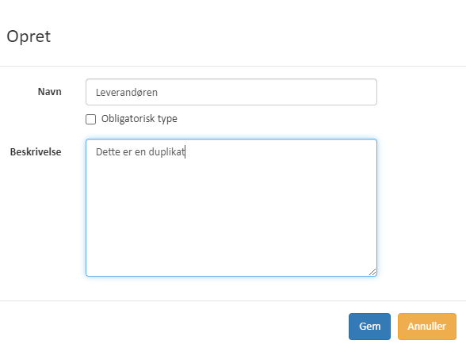
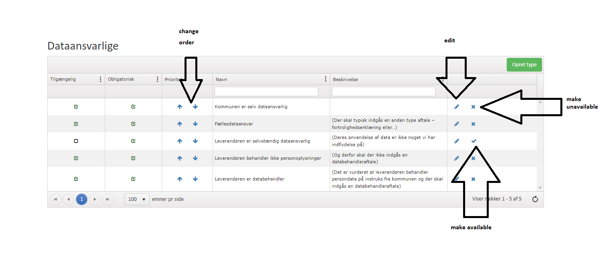
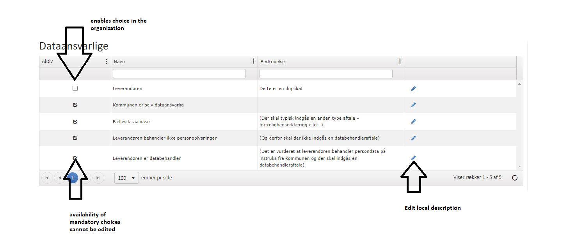
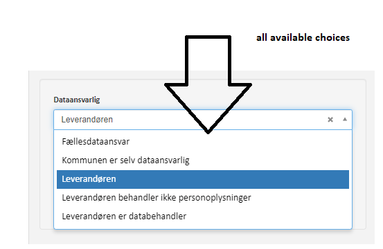
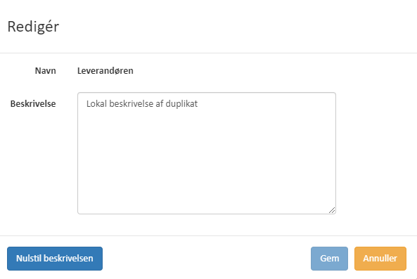
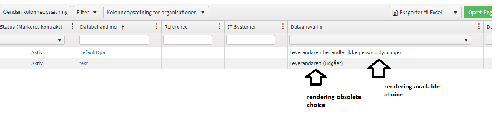
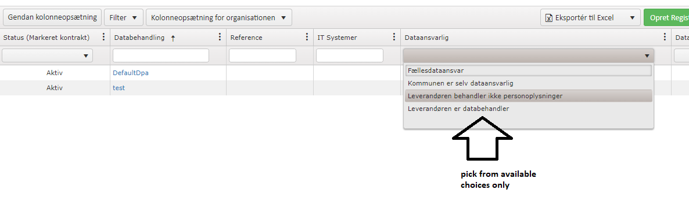
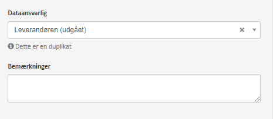
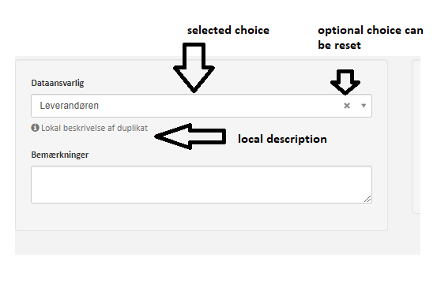
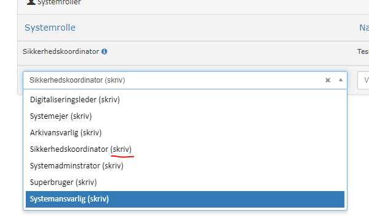

# Choice types in kitos

[Original Confluence page](https://strongminds.atlassian.net/wiki/spaces/KITOS/pages/877527041)

# Choice types and config responsibilities

In KITOS, we have to support user defined choice types (closed value range)

* Choice types are **created** by the **global admin**

    * **The global admin** sets the following base information:

        * Name
        * Default description (to be shown under a selection control when he value is selected)
        * Default order (in the selection list)
        * Mandatory choice (enabled in all organizations)
        * Availability

            * If the choice is not available, it will be removed from the valid input range
            * If the choice is available, but no mandatory, the choice will be enabled for inclusion by the Local Admin


    * The **Local Admin** configures the choice types within the organization and is able to change

        * Availability (if choice is not set as mandatory and choice has been enabled by the global admin)
        * Override the description.


**Obsolete choices**

If a choice has been selected in a registration, and the local or global admin makes the choice unavailable, then the choice will still be selected, but the user will be informed by the obsolete choice.

# Choice type variations

The choice types come in two variants

* Regular choices (name, description, order, availability, mandatory)
* Roles: Extends the regular choices with a “WriteAccess” flag.

# API example

## Get all available countries

`GET /api/v2/data-processing-registration-country-types`

```
[
  {
    "uuid": "00000000-0000-0000-0000-000000000000",
    "name": "string"
  }
]
```

**NOTE:** Only available choices are returned

## Get a specific country

`GET /api/v2/data-processing-registration-country-types/{countryUuid}`

```
{
  "isAvailable": true,
  "uuid": "00000000-0000-0000-0000-000000000000",
  "name": "string"
}
```

**NOTE:** The response of the specific country also includes the availability flag.

# UI Example (from the old UI)

## Global admin perspective




Overview



Creating a new optional choice


## Local admin perspective




overview



Edit/reset local description. Reset loads the global description


## User perspective




selection from available choices



selected choice and description



selected obsolete choice



Filtering in overviews



rendering in overviews



Selection of role-type choices. Notice the “(skriv)” which is appended to roles with “write access”
