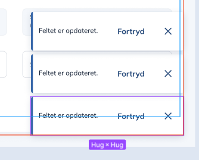

# Data change toast messages (with optional revert func)

[Original Confluence page](https://strongminds.atlassian.net/wiki/spaces/KITOS/pages/877527076)

Whan field data is changed, we should see a toast message

This is also used when updates fail

**Optionally** when possible, we should support “Fortryd” (an injected handler?). It should not be mandatory
