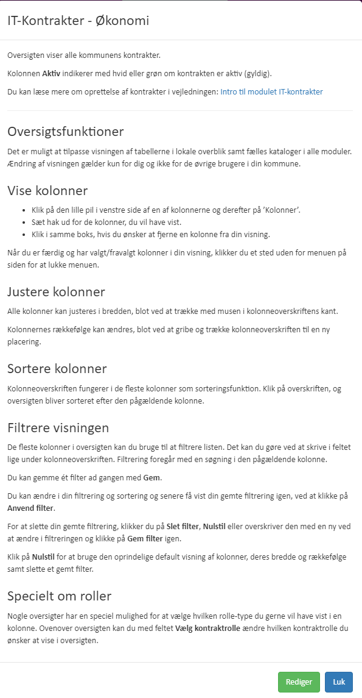
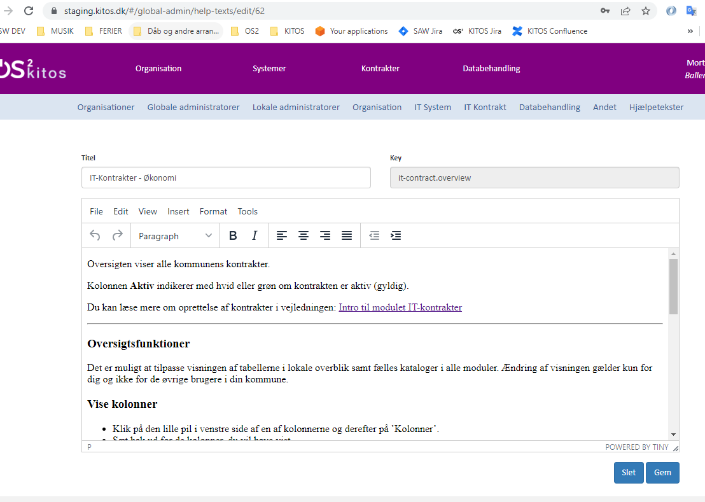
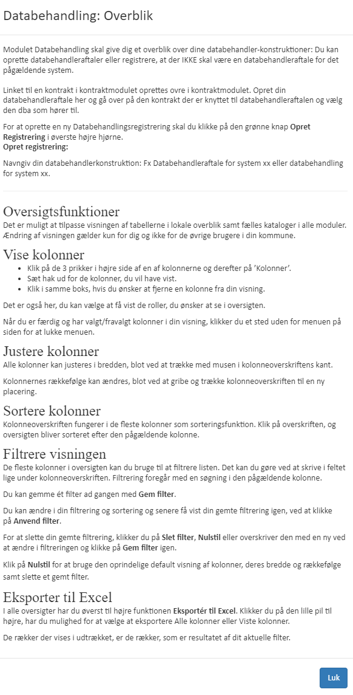

# Help text dialogs

[Original Confluence page](https://strongminds.atlassian.net/wiki/spaces/KITOS/pages/877035560)

# Description

* Help text dialogs are opened from the “?” typically placed on the right top corner of “blocks”
* Help texts consist of

    * `key` - used in the angular app as a const id when the text is created/updated/read
    * `title` Simple string
    * `text` Full rich html text

* The help text dialog gets the data by `key` from `GET /odata/HelpTexts({Id})`
* Dialog has fallback text if no text is found
* If the “Global Admin” opens the help text dialog, they get an “edit” button, which takes them to the “edit helptext page”

# Examples from the old ui

## Global admin view

### View

### Edit

## Regular user view

